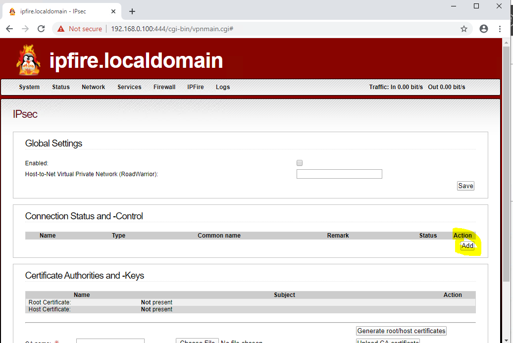
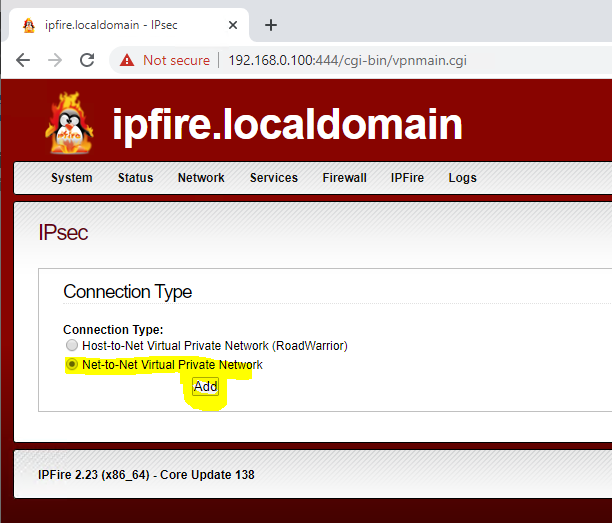
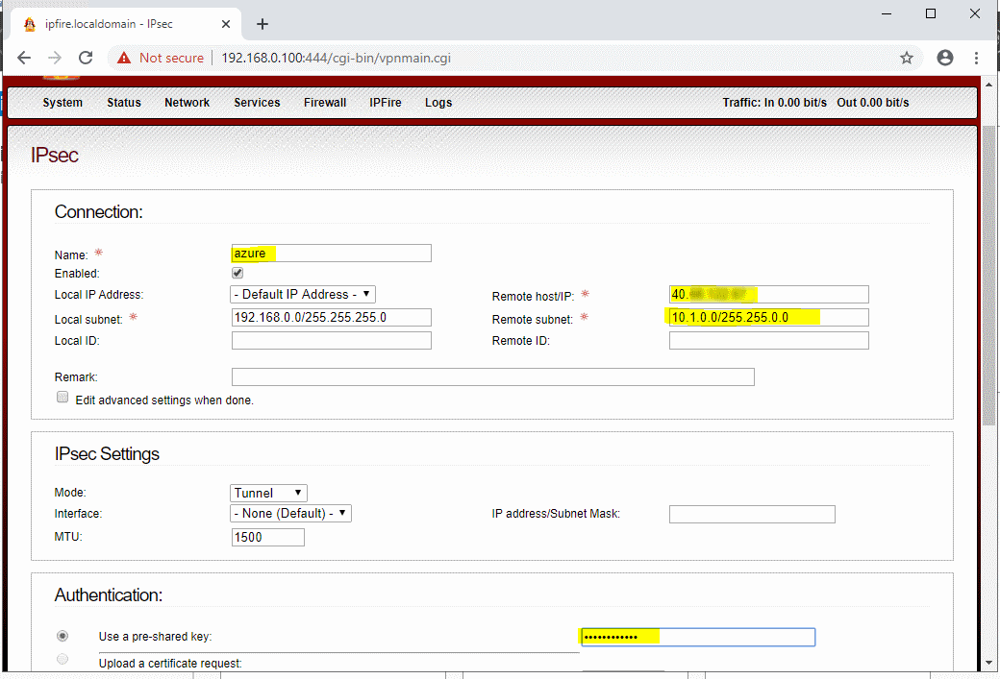
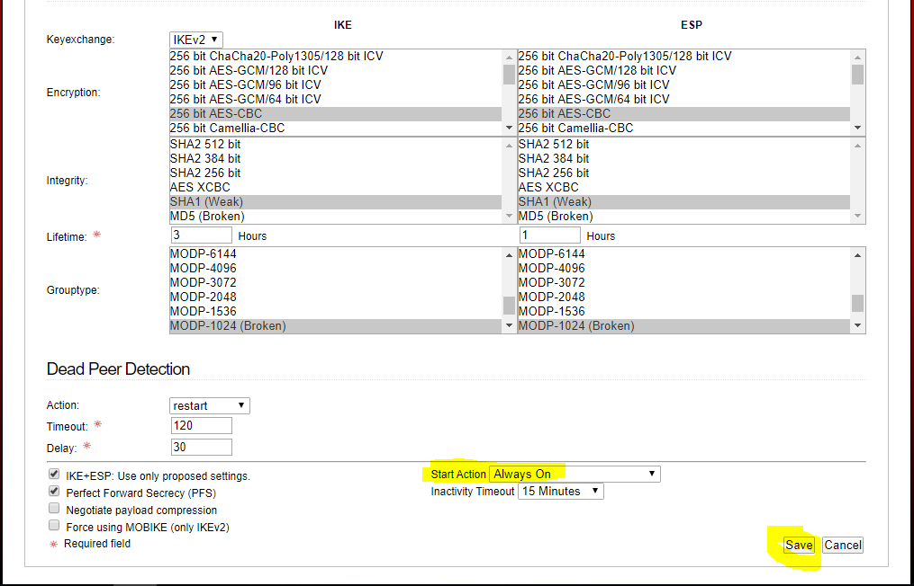
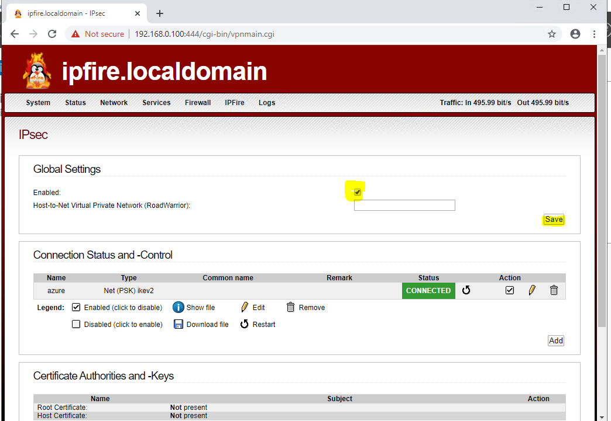
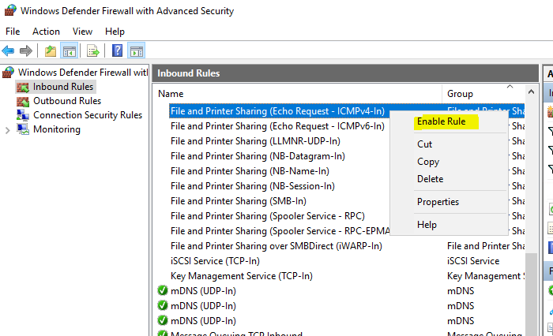

# Challenge 8: Networking - VPN: Enabling Hybrid Networking with a Site-2-Site (Onprem to Azure) VPN Connection
[back](../../README.md)  

## Here is what you will learn ##
- What it takes to implement a VPN tunnel between your onprem firewall <---VPN S2S---> Azure 

## An Azure S2S VPN requires: ##
**Azure**
- VPN Gateway in its own subnet.
- VPN GWay requires a dynamic Public IP
- Settings how the onprem VPN / FWall is to be contacted (aka LocalNetworkGateway)
- Connection Objekt with e.g. shared key

**onprem**
- A supported device Azure can talk to.

## Create a VPN Gateway and a Public IP using the portal ##
```
[Azure Portal] -> '+ Create a resource' -> type "Virtual network gateway"
  -> Create
```
**Use the following parameter values**:  

| Parameter Name | Values  |
|---|---|
| Name  |  **myAzVPNGWay** |  
| Region| **North Europe** |
| Gateway type| VPN |
| VPN Type| Route based |
| Gateway type| VPN |
| SKU| VpnGw1 |
| Generation | Generation 1 |
| Virtual Network | **azurevnet** |
| Public IP address | create new  |
| Public IP address name | **myAzVPNGWay-IP** |
| Enable active-active mode | Disabled |
| Configure BGP ASN | Disabled |

-> the GW setup will take approx 30 mins. to create -> come back later...  
When your **GW has** been assigned a **public IP** address then you know **it is online**.  


## [Azure] Create a Local Network Gateway ##
The purpose of this task is to tell azure how to contact the onpremise firewall:  
```
[Azure Portal] -> '+ Add' -> type 'Local network gateway' -> Create
```
| Parameter Name | Values  |
|---|---|
| Name  |  **l-gw-ipfire** |  
| IP address| **_%IP of your Firewall - ask instructor%_**|
| Address Space | **192.168.0.0/24** |
| Resource Group | **rg-contosomortgage-www** |
| Location | **North Europe** |

## [Azure] Create a connection object with shared key ##
```
[Azure Portal] -> Resource Groups -> rg-contosomortgage-www -> myAzVPNGWay
 -> Connections -> 
``` 
| Parameter Name | Values  |
|---|---|
| Name  |  **azure-to-onprem** |  
| Connection Type | **Site-to-Site (IPSec)** |
| Virtual Network Gateway| **myAzVPNGWay** |
| Local Network Gateway| **l-gw-ipfire** |
| Shared Key| *********** (your choice here) |
| IKE Protocol | IKEv2 |
| Resource Group | **rg-contosomortgage-www** |
| Location | North Europe |

## [Onpremise] Configure your onpremise VPN counterpart e.g. ipfire ##
**Logon to the IPFire -> ask your instructor.**  
Open a browser and navigate to: https://192.168.0.100:444 -> ignore certificate warning -> proceed

**User**: admin  
**Password**: _Ask your instructor_  

```
   IPFire -> Services -> IPSec -> 'Connection Status and -Control' -> Add
```


```
   "Net-to-Net Virtual Private Network" -> Add
```


| Parameter Name | Values  |
|---|---|
| Name | **azure** |
| Local subnet | 192.168.0.0/255.255.255.0 |
| Remote Host/IP  |  **_%'myAzVPNGWay-IP' VPN Gateway PIP in Azure%_** | 
| Remote subnet | **_%Address Range of the virtual network in azure with mask% (e.g. 10.1.0.0/255.255.0.0)_** |
| Use a pre-shared key | **_Shared Key you used in azure before_**|

 
**Save**

**Click on the pencil symbol and choose 'Advanced'**:
 

Select the **following algorithms / suites for the connection**:
  
**select Always on** then **Save**

**Tick checkbox to enable connection** - connection status should go to green:
 

**Now let's ping your azure vm** (e.g. vmweb01) under its private ip (probably: 10.1.0.4) from onpremise.  
Do you receive a response?  
You might need to allow ping first  
 )

[back](../../README.md) 