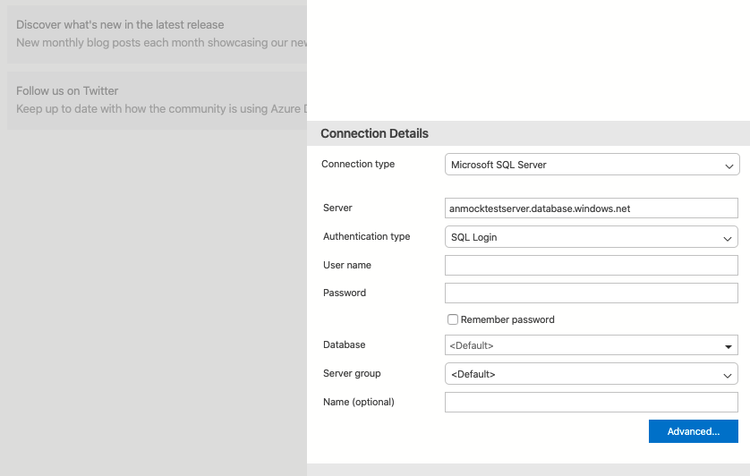
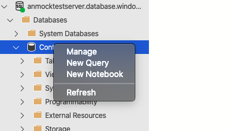

# Azure SQL DB #


## Here is what you will learn ##

- Create an Azure SQL DB (Single Database)
- Add Data to the Azure SQL DB
- Setup Dynamic Data Masking

Azure SQL Database is a general-purpose relational database, provided as a managed service. It's based on the latest stable version of [Microsoft SQL Server database engine](https://docs.microsoft.com/sql/sql-server/sql-server-technical-documentation?toc=/azure/sql-database/toc.json). In fact, the newest capabilities of SQL Server are released first to SQL Database, and then to SQL Server itself. You get the newest SQL Server capabilities with no overhead for patching or upgrading, tested across millions of databases.

To get startet with SQL Database the documentation [here](https://docs.microsoft.com/en-us/azure/sql-database/sql-database-technical-overview) is a good starting point.

## Deployment models

Let us have a look at the different deployment models of SQL Database first:


- Single database represents a fully managed, isolated database. You might use this option if you have modern cloud applications and microservices that need a single reliable data source. A single database is similar to a contained database in Microsoft SQL Server Database Engine.
- Managed instance is a fully managed instance of the Microsoft SQL Server Database Engine. It contains a set of databases that can be used together. Use this option for easy migration of on-premises SQL Server databases to the Azure cloud, and for applications that need to use the database features that SQL Server Database Engine provides.
- Elastic pool is a collection of single databases with a shared set of resources, such as CPU or memory. Single databases can be moved into and out of an elastic pool.

## Purchasing models

SQL Database offers the following purchasing models:

- The vCore-based purchasing model lets you choose the number of vCores, the amount of memory, and the amount and speed of storage.
- The DTU-based purchasing model offers a blend of compute, memory, and I/O resources in three service tiers, to support light to heavy database workloads. Compute sizes within each tier provide a different mix of these resources, to which you can add additional storage resources
- The serverless model automatically scales compute based on workload demand, and bills for the amount of compute used per second. The serverless compute tier also automatically pauses databases during inactive periods when only storage is billed, and automatically resumes databases when activity returns.

You see that each purchasing model refers to compute, memory and I/O resources, because this are the most important and crtical resources a databse uses.


## Create a single SQL Database

The single database deployment option creates a database in Azure SQL Database with its own set of resources and is managed via a SQL Database server. With a single database, each database is isolated from each other and portbale, each with its own service tier within the DTU-based purchasing model or vCore-based purchasing model and a guaranteed compute size. 

Open a shell, we use Azure CLI to create the nneded Azure resources:

1. Create a resource group:
   ```Shell
   az group create --name <your rg name> --location <your Azure region>
   ```
2. Create the server instance and note down the __fullyQualifiedDomainName__ of your server from the output
   ```
   az sql server create --name <name of the server> --resource-group <your rg name> --location <your Azure region> --admin-user <name of your admin> --admin-password <pwd>
   ```
3. Configure the server's firewall to allow your Ip
   ```Shell
   az sql server firewall-rule create --server <name of your server> --resource-group <your rg name> --name AllowYourIp --start-ip-address <your public ip> --end-ip-address <your public Ip> 
   ```
4. Create the SQL Database with vCore-based purchasing Gen4, 1 vCore and max 32GB in size. [Here](https://docs.microsoft.com/en-us/azure/sql-database/sql-database-service-tiers-vcore) you will find a good overview of the vCore model.
   ```Shell
   az sql db create --name ContactsDb --resource-group [your rg name] --server <name of your server> --edition GeneralPurpose --family Gen4 --capacity 1 --max-size 32GB --zone-redundant false
   ```

## Add Data to SQL DB ##

Now that your SQL Database is up and running it's time to add some data. Open the `Azure Data Studio` and connect to your server:



After you have connected to your server `Azure Data Studio` wants you to add your Azure account. Follow the instructions and add your account.
Next we want to create our first table in the ContactsDb. Navigate to the ContactDb, open the context menu and select `New Query`.



Add and run the following query:

```Sql
CREATE TABLE Contacts (EmployerID int, LastName varchar(255), FirstName varchar(255), Age int, StartYear int)
```

Create a new query and insert a row:

```Sql
INSERT INTO Contacts (EmployerID, LastName, FirstName, Age, StartYear) VALUES (42, 'Nadella', 'Satya', 51, 2014)
```

## Setup Dynamic Data Masking

Dynamic data masking (DDM) limits sensitive data exposure by masking it to non-privileged users. It can be used to greatly simplify the design and coding of security in your application. take a look at the documentation [here](https://docs.microsoft.com/en-us/sql/relational-databases/security/dynamic-data-masking?view=sql-server-ver15) to get more information about Dynamic Data Masking


To see Dynamic Data Masking in action we first add a column to the Contacts table with a Data Masking Rule.
Back in Azure Data Studio create a new query and run a command as follows:

```Sql
ALTER TABLE [dbo].[Contacts]
ADD Email varchar(256) MASKED WITH (FUNCTION = 'default()');
```
Run another query to add another row:

```Sql
INSERT INTO Contacts (EmployerID, LastName, FirstName, Age, StartYear, Email) VALUES (43, 'Nadella', 'Satya', 51, 2014, 'snad@microsoft.com')
```
When we select the top 1000 rows of the Contacts table we still see the email's actual value.


The reason behind this is that the account we have used has elevated privileges. To show you how Dynamic Data Masking works we just create a user and grant select on Contacts. Create a new query and run the commands as follows:

```Sql
CREATE USER TestUser WITHOUT LOGIN;  
GRANT SELECT ON Contacts TO TestUser;  
  
EXECUTE AS USER = 'TestUser';  
SELECT * FROM Contacts; 
```


## Clean up ##

Delete Resource Group

```az group delete -name <your rg name>```
