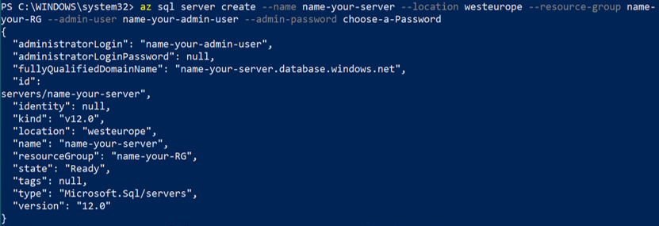
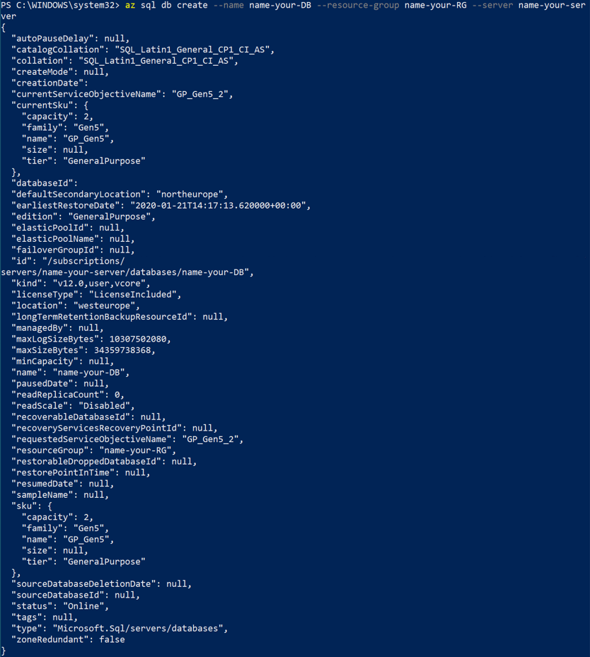
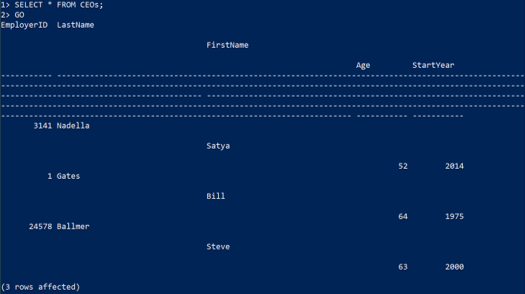
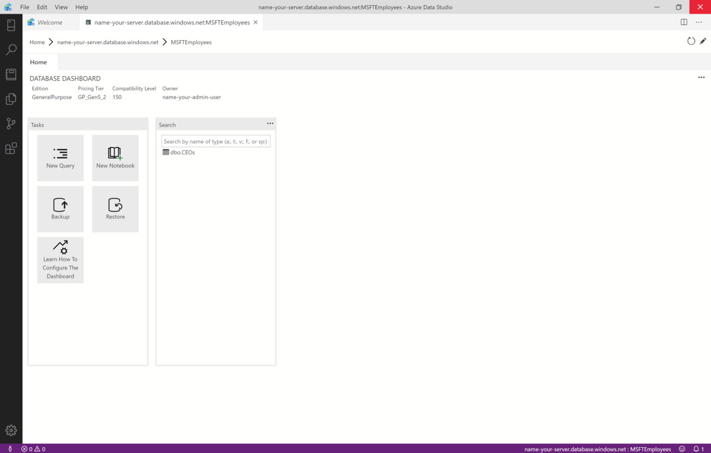
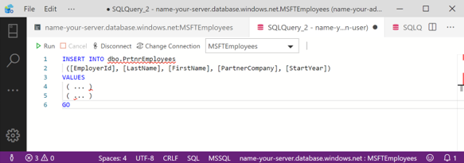
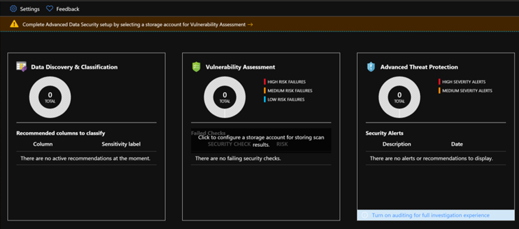

# Azure SQL DB #

Azure SQL Database is a general-purpose relational database, provided as a managed service. With it, you can create a highly available and high-performance data storage layer for the applications and solutions in Azure. SQL Database can be the right choice for a variety of modern cloud applications because it enables you to process both relational data and non-relational structures, such as graphs, JSON, spatial, and XML.

It's based on the latest stable version of the Microsoft SQL Server database engine. You can use advanced query processing features, such as high-performance in-memory technologies and intelligent query processing. In fact, the newest capabilities of SQL Server are released first to SQL Database, and then to SQL Server itself. You get the newest SQL Server capabilities with no overhead for patching or upgrading, tested across millions of databases.

SQL Database enables you to easily define and scale performance within two different purchasing models: a vCore-based purchasing model and a DTU-based purchasing model. SQL Database is a fully managed service that has built-in high availability, backups, and other common maintenance operations. Microsoft handles all patching and updating of the SQL and operating system code. You don't have to manage the underlying infrastructure.

## Here is what you will learn ##

- Create an Azure SQL DB
- Add Data to the Azure SQL DB
- Secure the Azure SQL DB
- Azure SQL DB elastic pools
- 

## Create an Azure SQL DB ##

We are going to use the Azure CLI as well as the Azure Portal for this exercise.
1. Create a resource group

```az group create --name [Name of your RG] --location westeurope```


2. Create an Azure SQL Server

```az sql server create --name [Name of your SQL Server] --resource-group [Name of your RG] --location westeurope --admin-user [Name of your Server Admin] --admin-password [Your Admin Password]```



3. Create an Azure SQL DB

```az sql db create --name MSFTEmployees --resource-group [Name of your RG] --location westeurope --edition GeneralPurpose --family Gen4 --capacity 1 --zone-redundant false```



4. There are several options to make the Azure SQL DB accessible. Per default the access is not permitted via the Azure SQL Server. To allow you to interact with your DB you can create a Firewall-Rule to allow your IP on the Server and hence the DB

```az sql server firewall-rule create --name [Name of your Firewall Rule] --resource-group [Name of your RG] --server [Name of your server] --start-ip-address [your IP address] --end-ip-address [your IP address]```


4. Optional: Add scalability options

```az sql db list-usage --name MSFTEmployees --resource-group [Name of your RG] --server [Name of your SQL Server]```
```az sql db create --name MSFTEmployees --resource-group [Name of your RG] --location westeurope --edition GeneralPurpose --family Gen4 --capacity 2 --zone-redundant false```
  

## Add Data to SQL DB ##

A Table will be created and Data entered

Use the Azure Cloud Shell

1. Get to know your environment

  ```az sql server list --resource-group [Name of your RG]```
  ```az sql db list --resource-group [Name of your RG] --server [Name of your Server]```
  
If you run the command like this you are getting a lot of information to make sense of. You can restrict this by using a query

  ```az sql db list --resource-group [Name of your RG] --query '[].{Name:name}'```
  
  ```az sql db show --resource-group [Name of your RG] --name MSFTEmployees --query '{name: .name, maxSizeBytes: .maxSizeBytes, status: .status}'```
  
2. Connect to the DB

  ```az sql db show-connection-string --name MSFTEmployees --server [Name of your Server] --client sqlcmd```

Copy the sqlcmd command and enter your admin name and password. The command should look something like this:
  
  ```sqlcmd -S tcp:[Name of your Server].database.windows.net,1433 -d MSFTEmployees -U [Name of your Server Admin] -P [Your Admin Password] -N -l 30```
  
After running this you should see a ```1>```. Now you can run SQL Queries. If you are unfamiliar with their Syntax feel free to take some time getting used to it.

3. Add a table.

  ```CREATE TABLE CEOs (EmployerID int, LastName varchar(255), FirstName varchar(255), Age int, StartYear int); GO```
  
  

4. Add Data to your table

  ```INSERT INTO CEOs (EmployerID, LastName, FirstName, Age, StartYear) VALUES (42, 'Nadella', 'Satya', 51, 2014); GO```
  
  

5. Update the Age of Satya Nadella in the Table

  ```UPDATE CEOs SET Age=52 WHERE EmployerID=42; GO```
  
6. Query the data

   ```SELECT * FROM CEOs;```
   
   
  
7. Add the other CEOs Microsoft has had to the list as well (the ID is fictional). To ```exit``` enter exit.

## Use the Azure Data Studio ##

Azure Data Studio is a cross-platform database tool for data professionals using the Microsoft family of on-premises and cloud data platforms on Windows, MacOS, and Linux.

Azure Data Studio offers a modern editor experience with IntelliSense, code snippets, source control integration, and an integrated terminal. It's engineered with the data platform user in mind, with built-in charting of query result sets and customizable dashboards.

The source code for Azure Data Studio and its data providers is available on GitHub under a source code EULA that provides rights to modify and use the software, but not to redistribute it or host it in a cloud service. For more information, see Azure Data Studio FAQ.

1. Connect to your SQL Server by using the SQL Server Name you created earlier and the SQL Login.



2. Create a new Query and with it a new Table

   ```IF OBJECT_ID('dbo.PrtnrEmployees', 'U') IS NOT NULL
        DROP TABLE dbo.PrtnrEmployees;
      GO
      CREATE TABLE dbo.PrtnrEmployees
      (
        EmployerId int NOT NULL PRIMARY KEY,
        LastName nvarchar(255) NOT NULL,
        FirstName nvarchar(255) NOT NULL,
        PartnerCompany nvarchar(255) NOT NULL,
        StartYear int
       );
       GO```
       


3. Insert at least four data rows into your new table creating a new Query in the Azure Data Studio

   ```INSERT INTO dbo.PrtnrEmployees
        (EmployerId, LastName, FirstName, PartnerCompany, StartYear)
      VALUES
        ( ... ),
        ( ... )
      GO```



4. View the data returned by a query

   ```SELECT * FROM dbo.PrtnrEmployees;```
   
   ```SELECT * FROM dbo.CEOs;```

## Secure the Azure SQL DB ##

There are many tasks surrounding the securing of an Azure SQL DB and and Azure SQL Server.


### Network Security for Azure SQL DB ###

To help protect the data, firewalls prevent network access to the database server until access is explicitly granted based on IP address or Azure Virtual network traffic origin. Earlier we opened up the SQL Server for our own IP address by creating a firewall rule. Now we are having a look at Virtual network firewall rules.

1. Create the Virtual Network

   ```az network vnet create --name [Name of your VNet] --resource-group [Name of your RG] --location westeurope --address-prefixes [xxx.xxx.xxx.xxx/xx]```

2. Create the service endpoint and take a look at what was created

   ```az network vnet subnet create --name [Name of your Subnet] --resource-group [Name of your RG] --vnet-name [Name of your VNet] --address-prefix [xxx.xxx.xxx.xxx/xx] --service-endpoints Microsoft.SQL```

   ```az network vnet subnet show --name [Name of your Subnet] --resource-group [Name of your RG] --vnet-name [Name of your VNet]```

3. Create a VNet rule on the server to secure it to the subnet Note

   ```az sql server vnet-rule create --name [Name of your VNet Rule] --resource-group [Name of your RG] --vnet-name [Name of your VNet] --subnet [Name of your Subnet] --server [Name of your SQL Server]```

Note: Controlling access with firewall rules does not apply to a managed instance.

### Access Management for Azure SQL DB ###

Under Access Management we are taking a look at authentication and authorization. Authentication is the process of proving the user is who they claim to be. Authorization refers to the permissions assigned to a user within an Azure SQL Database, and determines what the user is allowed to do.

Azure SQL Database supports two types of authentication: SQL authentication, as has been set up with the server admin and password while creating the Azure SQL Server. And Azure Active Directory authentication.

1. Let's have a look at the SQL authentication. As server admin you can create additional SQL logins and users - which enables other users to connect to the SQL Database. For this one open the Azure portal.

```sqlcmd -S tcp:[Name of your Server].database.windows.net,1433 -d MSFTEmployees -U [Name of your Server Admin] -P [Your Admin Password] -N -l 30```

```CREATE USER Marvin WITH PASSWORD = '42_as_ANSWER!'; GO```

2. Now create a new Table with this user.

```exit```

```sqlcmd -S tcp:[Name of your Server].database.windows.net,1433 -d MSFTEmployees -U Marvin -P 42_as_ANSWER! -N -l 30```

```CREATE TABLE Bees (EmployerID int, LastName varchar(255), FirstName varchar(255), RoleName varchar (255), StartYear int); GO```

Add some Data to the table and query them.

When doing this remember that there is still a firewall rule in place - the new User currently has to operate under the same IP address you previously added to the SQL server firewall rule.

Note: The Azure Active Directory authentication is a far more suitable and contemporary solution. Learn more about it at our Friday sessions.

Authorization refers to the permissions assigned to a user. Permissions are controlled by adding user accounts to database roles and assigning database-level permissions to those roles or by granting the user certain object-level permissions. As always there is more than one way to implement this.

3. There are also database roles for SQL Server and database. You will find fixed roles as well as custom roles. Let's have a look at the fixed roles. To add and remove users to or from a database role, use the ADD MEMBER and DROP MEMBER options of the ALTER ROLE statement.

    ```sqlcmd -S tcp:[Name of your Server].database.windows.net,1433 -d MSFTEmployees -U [Name of your Server Admin] -P [Your Admin Password] -N -l 30```

   ```ALTER ROLE  db_backupoperator  
      {  
        ADD MEMBER database_principal  
        |  DROP MEMBER database_principal  
        |  WITH NAME = new_name  
      }  
      [;]  ```
 
 

4. Custom roles can be created by granting access to specific Objects and Users. In this example, we will block access from a specific value for the previously added user Marvin.

   ```sqlcmd -S tcp:[Name of your Server].database.windows.net,1433 -d MSFTEmployees -U [Name of your Server Admin] -P [Your Admin Password] -N -l 30```
   
   ```REVOKE SELECT ON OBJECT::CEOs.EmployerID TO Marvin; GO```
   
   ```exit```
   
   ```sqlcmd -S tcp:[Name of your Server].database.windows.net,1433 -d MSFTEmployees -U Marvin -P 42_as_ANSWER! -N -l 30```
   
Now try to access the variable. 
As Admin you can grant access again like this:

   ```GRANT SELECT ON OBJECT::CEOs.EmployerID TO Marvin; GO```

5. While we are not setting up the AD authentication, here you can see the syntax of creating a user:
   
   ```CREATE USER [Azure AD principal name] FROM EXTERNAL PROVIDERS; GO```
   

### Threat protection ###

SQL Database secures data by providing auditing and threat detection capabilities.

1. As part of that Advanced Threat Protection is analyzing your SQL Server logs to detect unusual behavior and potentially harmful attempts to access or exploit databases. Alerts are created for suspicious activities such as SQL injection, potential data infiltration, and brute force attacks or for anomalies in access patterns to catch privilege escalations and breached credentials use. Alerts are viewed from the Azure Security Center, where the details of the suspicious activities are provided and recommendations for further investigation given along with actions to mitigate the threat. We are going to enable this feature.

   ```az storage account create --name [Name of your storage account] --resource-group [Name of your RG] --location westeurope```

   ```az sql db threat-policy update --resource-group [Name of your RG] --server [Name of your Server] --name MSFTEmployees --email-account-admins Enabled --email-addresses [any E-Mail Address] --state Enabled --storage-account [Name of your storage account]```

2. SQL Database auditing tracks database activities and helps to maintain compliance with security standards by recording database events to an audit log in a customer-owned Azure storage account. Auditing allows users to monitor ongoing database activities, as well as analyze and investigate historical activity to identify potential threats or suspected abuse and security violations.

   ```az sql db audit-policy update --storage-account [Name of your Storage Account] --server [Name of your Server] --resource-group [Name of your RG] --name [Name of your DB] --state Enabled```

   This is a complex topic. To grasp it fully visit the Azure portal. Go to your Azure SQL DB. Under Security move to the Auditing tab. Now enable Log Analytics and Event Hub.

### Information protection and encryption ###

There are different Methods to secure the information stored in a SQL Database. We are going to look at the standards. For advanced security you can look up the Azure Key Vault and Always Encrypted.

1. SQL Database secures customer data by encrypting data in motion with Transport Layer Security.

   Sql Server enforces encryption (SSL/TLS) at all times for all connections. This ensures all data is encrypted "in transit" between the client and server irrespective of the setting of Encrypt or TrustServerCertificate in the connection string.

   As a best practice, recommend that in your application's connection string you specify an encrypted connection and not trust the server certificate. This forces your application to verify the server certificate and thus prevents your application from being vulnerable to man in the middle type attacks.

   For example when using the ADO.NET driver this is accomplished via Encrypt=True and TrustServerCertificate=False. If you obtain your connection string from the Azure portal, it will have the correct settings and should look like this:

   ```Server=tcp:[Name of your SQL Server].database.windows.net,1433;Initial Catalog=MSFTEmployees;Persist Security Info=False;User ID=[Name of your Admin];Password=[Your Admin Password];MultipleActiveResultSets=False;Encrypt=True;TrustServerCertificate=False;Connection Timeout=30;```
   
2. Transparent Data Encryption (TDE) for Azure SQL Database adds a layer of security to help protect data at rest from unauthorized or offline access to raw files or backups. Common scenarios include datacenter theft or unsecured disposal of hardware or media such as disk drives and backup tapes. TDE encrypts the entire database using an AES encryption algorithm, which doesn’t require application developers to make any changes to existing applications.

   In Azure, all newly created SQL databases are encrypted by default and the database encryption key is protected by a built-in server certificate. Certificate maintenance and rotation are managed by the service and requires no input from the user. Customers who prefer to take control of the encryption keys can manage the keys in Azure Key Vault.
   
   ```az sql db tde set --status Enabled --database MSFTEmployees --resource-group [Name of your RG] --server [Name of your SQL Server]```

### Data Security Management ###

Data discovery & classification (currently in preview) provides advanced capabilities built into Azure SQL Database for discovering, classifying, labeling, and protecting the sensitive data in your databases. Discovering and classifying your utmost sensitive data (business/financial, healthcare, personal data, etc.) can play a pivotal role in your organizational Information protection stature. It can serve as infrastructure for:

Various security scenarios, such as monitoring (auditing) and alerting on anomalous access to sensitive data.
Controlling access to, and hardening the security of, databases containing highly sensitive data.
Helping meet data privacy standards and regulatory compliance requirements.

1. Go to the Azure Portal. In your SQL Database Advanced Threat protection you will find information about your Data.
   Look up if you can change any of the metrics.
   


## SQL Databace backup and retention policies ##

You make the choice between configuring your server for either locally redundant backups or geographically redundant backups at server creation.
After a server is created, the kind of redundancy it has, geographically redundant vs locally redundant, can't be switched.
While creating a server via the ```az sql server create``` command, the ```--geo-redundant-backup``` parameter decides your Backup Redundancy Option. If ```Enabled```, geo redundant backups are taken. Or if ```Disabled``` locally redundant backups are taken.
In our current database geo redundant backups therefore are not possible.

1. Go to the Azure portal and navigate to your SQL server. Under Manage Backups you will find the retention policies. Change the retention policy for MicrosoftEmployees to Monthly Backups that should be kept for 8 weeks.
   On the Available backups tab, you will find backups from which you can restore a specific database.
   
As a declarative abstraction on top of the existing active geo-replication feature, Auto-failover groups are a SQL Database feature that allows you to manage replication and failover of a group of databases on a SQL Database server or all databases in a managed instance to another region.
They are designed to simplify deployment and management of geo-replicated databases at scale.

When you are using auto-failover groups with automatic failover policy, any outage that impacts one or several of the databases in the group results in automatic failover. Typically these are incidents that cannot be self-mitigated by the built-in automatic high availability operations. The examples of failover triggers include an incident caused by a SQL tenant ring or control ring being down due to an OS kernel memory leak on several compute nodes, or an incident caused by one or more tenant rings being down because a wrong network cable was cut during routine hardware decommissioning. For more information, see SQL Database High Availability.

1. Create another Azure SQL Server

   ```az sql server create --name [Name of your second SQL Server] --resource-group [Name of your RG] --location northeurope --admin-user [Name of your Server Admin] --admin-password [Your Admin Password]```
   
2. Create a failover group between the servers and add the database

   ```az sql failover-group create --name [Name of your Failover Group] --partner-server [Name of your second SQL Server] --resource-group [Name of your RG] --server [Name of your SQL Server] --add-db MSFTEmployees --failover-policy Automatic```
   
3. Verify which server is secondary 

   ```az sql failover-group list --server [Name of your SQL Server] --resource-group [Name of your RG]```
   
4. Failover to the secondary server

   ```az sql failover-group set-primary --name [Name of your Failover Group] --resource-group [Name of your RG] --name [Name of your second SQL Server]```

5. Revert failover group back to the primary server

   ```az sql failover-group set-primary --name [Name of your Failover Group] --resource-group [Name of your RG] --name [Name of your SQL Server]```
  
## Connect the Azure SQL DB to a Web Application ##

This tutorial shows how to create a .NET Core app and connect it to a SQL Database. When you're done, you'll have a .NET Core MVC app running in App Service.

1. Clone the sample application

  ```git clone https://github.com/azure-samples/dotnetcore-sqldb-tutorial```
  ```cd dotnetcore-sqldb-tutorial```

2. Install the required packages, run database migrations, and start the application.

   ```dotnet tool install --global dotnet-ef 
      dotnet restore
      dotnet ef database update
      dotnet run```
      
  Navigate to ```http://localhost:5000``` in a browser. Select the Create New link and create a couple to-do items.

   To stop .NET Core at any time, press ```Ctrl+C``` in the terminal.

3. Create a new database in the previously created SQL Server.

   ```az sql db create --resource-group [Name of your RG] --server [Name of your SQL Server] --name coreDB```
   
4. Create the connection string

   ```az sql db show-connection-string --name coreDB --server [Name of your Server] --client sqlcmd```
   
   The result should look something like this:
   
   ```Server=tcp:[Name of your Server].database.windows.net,1433;Database=coreDB;User ID=[Name of your Admin User];Password=[Your Admin Password];Encrypt=true;Connection Timeout=30;```
   
5. Configure a local git deployment. FTP and local Git can deploy to an Azure web app by using a deployment user. Once you configure your deployment user, you can use it for all your Azure deployments.

   ```az webapp deployment user set --user-name [Name your App User] --password [Your App User Password]```

6. Create an App Service plan. An App Service plan defines a set of compute resources for a web app to run. These compute resources are analogous to the server farm in conventional web hosting. One or more apps can be configured to run on the same computing resources (or in the same App Service plan).

   ```az appservice plan create --name [Name of your ASP] --resource-group [Name of your RG] --sku FREE``

7. Create a web app in the recently created App Service plan.
   
   ```az webapp create --resource-group [Name of your RG] --plan [Name of your ASP] --name [Name of your App] --deployment-local-git```
   
8. Configure the connection string. To set connection strings for your Azure app, use the az webapp config appsettings set command in the Cloud Shell. In the following command replace the [Your Connection String] parameter with the connection string you created earlier.

   ```az webapp config connection-string set --resource-group [Name of your RG] --name [Name of your App] --settings MyDbConnection="[Your Connection String]" --connection-string-type SQLServer```
   
   In ASP.NET Core, you can use this named connection string (```MyDbConnection```) using the standard pattern, like any connection string specified in appsettings.json. In this case, ```MyDbConnection``` is also defined in your appsettings.json. When running in App Service, the connection string defined in App Service takes precedence over the connection string defined in your appsettings.json. The code uses the appsettings.json value during local development, and the same code uses the App Service value when deployed.

9. Configure environment variable. Next, set ASPNETCORE_ENVIRONMENT app setting to Production. This setting lets you know whether you're running in Azure, because you use SQLite for your local development environment and SQL Database for your Azure environment.

   ```az webapp config appsettings set --name [Name of your App] --resource-group [Name of your RG] --settings ASPNETCORE_ENVIRONMENT="Production"```

10. Connect to SQL Database in production by opening the Startup.cs and finding the following code in your local repository:

   ```services.AddDbContext<MyDatabaseContext>(options =>```
        ```options.UseSqlite("Data Source=localdatabase.db"));```

   Replace it with the following code, which uses the environment variables that you configured earlier.
   
   ```// Use SQL Database if in Azure, otherwise, use SQLite
      if(Environment.GetEnvironmentVariable("ASPNETCORE_ENVIRONMENT") == "Production")
        services.AddDbContext<MyDatabaseContext>(options =>
            options.UseSqlServer(Configuration.GetConnectionString("MyDbConnection")));
      else
        services.AddDbContext<MyDatabaseContext>(options =>
            options.UseSqlite("Data Source=localdatabase.db"));

      // Automatically perform database migration
      services.BuildServiceProvider().GetService<MyDatabaseContext>().Database.Migrate(); 
   ```

   If this code detects that it's running in production (which indicates the Azure environment), then it uses the connection string you configured to connect to the SQL Database.

   The Database.Migrate() call helps you when it's run in Azure, because it automatically creates the databases that your .NET Core app needs, based on its migration configuration.  

   Save your changes, then commit it into your Git repository.
   
   ```git add .```
   ```git commit -m "connect to SQL DB in Azure"```
   
11. Push to Azure from Git. Add an Azure remote to your local Git repository. Replace [Local Git URL] with the URL of the Git remote from step 7, when ypu did create the web app.

   ```git remote add azure [Local Git URL]```

   Push to the Azure remote to deploy your app with the following command. When Git Credential Manager prompts you for credentials, make sure you enter the credentials you created in Configure a deployment user, not the credentials you use to sign in to the Azure portal. This might take some time.
   
   ```git push azure master```
   
12. Browse to the deployed app using your web browser.

   ```http://[Name of your App].azurewebsites.net```

### Congratulations! ###
You're running a data-driven .NET Core app in App Service.

## Azure SQL DB elastic pools ##

1. Create an elastic pool
  
  ```az sql elastic-pool create --name [Name of you SQL EP] --resource-group [Name of your RG] --server [Name of your SQL Server] --edition GeneralPurpose --family Gen4 --capacity 2```

2. Move the Azure SQL DB to the elastic pool

  ```az sql db update --name MSFTEmployees --resource-group [Name of your RG] --server [Name of your SQL Server] --elastic-pool [Name of you SQL EP]```


## Use ARM Template for automated deployment ##

https://github.com/Azure/azure-quickstart-templates/tree/master/201-sql-database-transparent-encryption-create

https://docs.microsoft.com/de-de/azure/sql-database/sql-database-resource-manager-samples?tabs=single-database


## Clean up ##

Delete Resource Group

```az group delete --name [Name of your RG]```
