# Azure (Cognitive) Search #

## Here is what you will learn ##

- Create an Azure Search Service in the Portal
- Add Cognitive Skills to Azure Search
- Integrate Azure Search in an Node JS Application
- Optional Add on: Create an Azure Cognitive Search index in Python using Jupyter notebooks

# What is Azure Cognitive Search?

Azure Cognitive Search is a search-as-a-service cloud solution that gives developers APIs and tools for adding a rich search experience over private, heterogeneous content in web, mobile, and enterprise applications. Your code or a tool invokes data ingestion (indexing) to create and load an index. Optionally, you can add cognitive skills to apply AI processes during indexing. Doing so can add new information and structures useful for search and other scenarios.

On the other side of your service, your application code issues query requests and handles responses. The search experience is defined in your client using functionality from Azure Cognitive Search, with query execution over a persisted index that you create, own, and store in your service.


## What are the Features of Azure Cognitive Search?

## Feature descriptions

| Core&nbsp;search&nbsp;&nbsp;&nbsp;&nbsp;&nbsp;&nbsp;&nbsp;&nbsp;&nbsp;&nbsp;&nbsp;&nbsp;&nbsp;&nbsp;&nbsp;&nbsp;&nbsp;&nbsp;&nbsp;&nbsp;&nbsp;&nbsp;&nbsp;&nbsp;  | Features |
|-------------------|----------|
|Free-form text search | [**Full-text search**](search-lucene-query-architecture.md) is a primary use case for most search-based apps. Queries can be formulated using a supported syntax. <br/><br/>[**Simple query syntax**](https://docs.microsoft.com/en-us/rest/api/searchservice/simple-query-syntax-in-azure-search) provides logical operators, phrase search operators, suffix operators, precedence operators.<br/><br/>[**Lucene query syntax**](https://docs.microsoft.com/en-us/rest/api/searchservice/lucene-query-syntax-in-azure-search) includes all operations in simple syntax, with extensions for fuzzy search, proximity search, term boosting, and regular expressions.|
| Filters and facets | [**Faceted navigation**](search-faceted-navigation.md) is enabled through a single query parameter. Azure Cognitive Search returns a faceted navigation structure you can use as the code behind a categories list, for self-directed filtering (for example, to filter catalog items by price-range or brand). <br/><br/> [**Filters**](query-odata-filter-orderby-syntax.md) can be used to incorporate faceted navigation into your application's UI, enhance query formulation, and filter based on user- or developer-specified criteria. Create filters using the OData syntax. 

In the SCM Application we are using the Lucene query syntax ([Lucene Query Syntax Examples](https://docs.microsoft.com/en-us/azure/search/search-query-lucene-examples)).

View the full Azure Cognitive Search Feature list here:
[Azure Cognitive Search Feature list](https://docs.microsoft.com/en-us/azure/search/search-what-is-azure-search#feature-descriptions)

# Create an Azure Search Service in the Portal

0. Create a Resoure Group and add a Resource called **Azure Cognitive Search**

1. First, create a `Azure Search` instance in the Azure Portal

2. For our purposes, the `Free Tier` is sufficient

However, the `Free Tier` does not support additional replicas, scaling and is only able to index documents with up to 32000 characters/document. If we want to index longer documents, we need to go to a bigger tier (64000 for `Basic`, 4m for `Standard` and above - as of November 2018).


View the Details of Creating an Azure Search Service in the Portal:

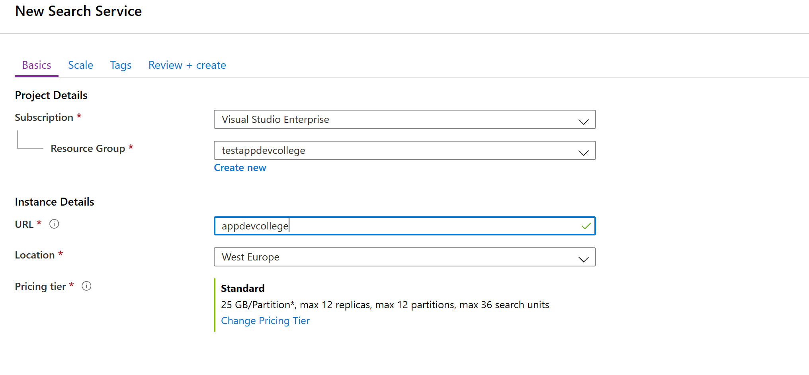

Once provisioned, our service will be reachable via `https://xxxxxxx.search.windows.net`

Azure Search [can index](https://docs.microsoft.com/en-us/azure/search/search-indexer-overview) data from a variety of sources:

* Azure SQL Database or SQL Server on an Azure virtual machine
* Azure Cosmos DB
* Azure Blob Storage
* Azure Table Storage
* Indexing CSV blobs using the Azure Search Blob indexer
* Indexing JSON blobs with Azure Search Blob indexer

In general you can upload your data to one of the sources and let Azure Search index it from there. You can do this completely through the Azure Portal, use [Storage Explorer](https://azure.microsoft.com/en-us/features/storage-explorer/) or use the API/CLI.

In our case, we'll choose a Sample Dataset hotel-sample

1. Now we can go into our Azure Search instance and go to `Import Data`

2. Next, we need to define the `Data Source` and choose Samples and select `hotels-sample` dataset

 

3. We'll skip `Cognitive Search` for this example. Azure Search automatically looks at the Blob container and will now extract the content and the metadata from all the PDFs. Let's give our Index a better name

4. Now let's create an index. Minimally, an index requires a name and a fields collection; one of the fields should be marked as the document key to uniquely identify each document. Additionally, you can specify language analyzers or suggesters if you want autocomplete or suggested queries.

Fields have data types and attributes. The check boxes across the top are *index attributes* controlling how the field is used.

* **Retrievable** means that it shows up in search results list. You can mark individual fields as off limits for search results by clearing this checkbox, for example for fields used only in filter expressions.
* **Key** is the unique document identifier. It's always a string, and it is required.
* **Filterable**, **Sortable**, and **Facetable** determine whether fields are used in a filter, sort, or faceted navigation structure.
* **Searchable** means that a field is included in full text search. Strings are searchable. Numeric fields and Boolean fields are often marked as not searchable.

Storage requirements do not vary as a result of your selection. For example, if you set the **Retrievable** attribute on multiple fields, storage requirements do not go up.

By default, the wizard scans the data source for unique identifiers as the basis for the key field. *Strings* are attributed as **Retrievable** and **Searchable**. *Integers* are attributed as **Retrievable**, **Filterable**, **Sortable**, and **Facetable**.

1. Accept the defaults. 

   If you rerun the wizard a second time using an existing hotels data source, the index won't be configured with default attributes. You'll have to manually select attributes on future imports. 

   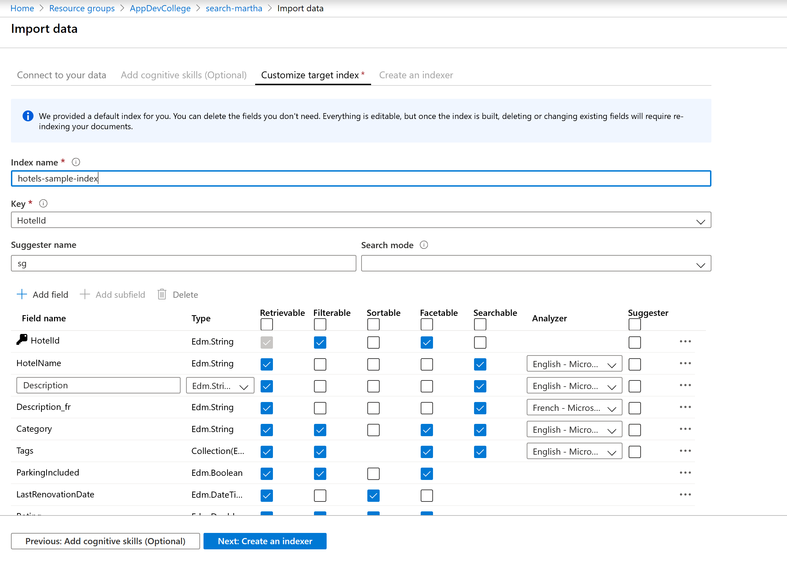

2. Continue to the next page.

Still in the **Import data** wizard, click **Indexer** > **Name**, and type a name for the indexer.

This object defines an executable process. You could put it on recurring schedule, but for now use the default option to run the indexer once, immediately.

Click **Submit** to create and simultaneously run the indexer.

  

5. After a minute or two, our Indexer will have indexed the hotel dataset and we should be able to query them.

## Querying Content

Open the Search Explorer in the Azure Portal, copy the queries (see below) and get familiar with the results of the queries:

### Simple query with top N results

#### String Query: `search=spa`

* The **search** parameter is used to input a keyword search for full text search, in this case, returning hotel data for those containing *spa* in any searchable field in the document.

* **Search explorer** returns results in JSON. For a better user experience, you will need to write code that [handles search results](https://docs.microsoft.com/en-us/azure/search/search-pagination-page-layout) to bring out important elements.

* Documents are composed of all fields marked as "retrievable" in the index. To view index attributes in the portal, click *hotels-sample* in the **Indexes** list.


#### Parameterized Query: `search=spa&$count=true&$top=10`

* The **&** symbol is used to append search parameters, which can be specified in any order.

* The **$count=true** parameter returns the total count of all documents returned. This value appears near the top of the search results. You can verify filter queries by monitoring changes reported by **$count=true**. Smaller counts indicate your filter is working.

* The **$top=10** returns the highest ranked 10 documents out of the total. By default, Azure Cognitive Search returns the first 50 best matches. You can increase or decrease the amount via **$top**.

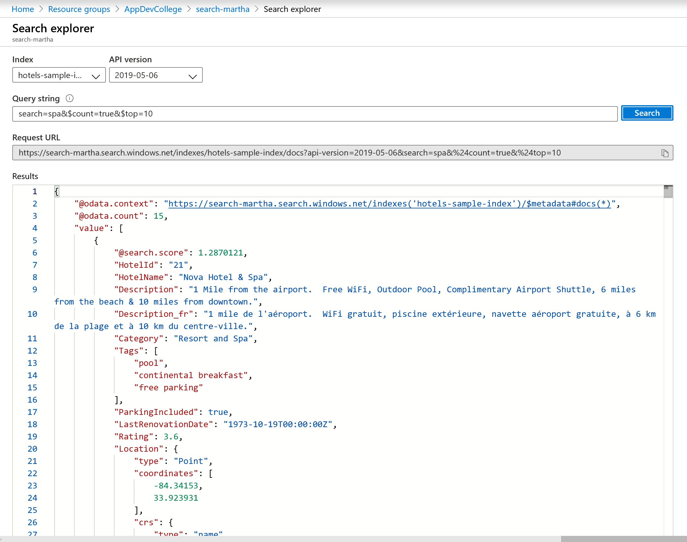

### <a name="filter-query"></a> Filter the query

Filters are included in search requests when you append the **$filter** parameter. 

#### Filtered Query: `search=beach&$filter=Rating gt 4`

* The **$filter** parameter returns results matching the criteria you provided. In this case, ratings greater than 4.

* Filter syntax is an OData construction. For more information, see [Filter OData syntax](https://docs.microsoft.com/rest/api/searchservice/odata-expression-syntax-for-azure-search).

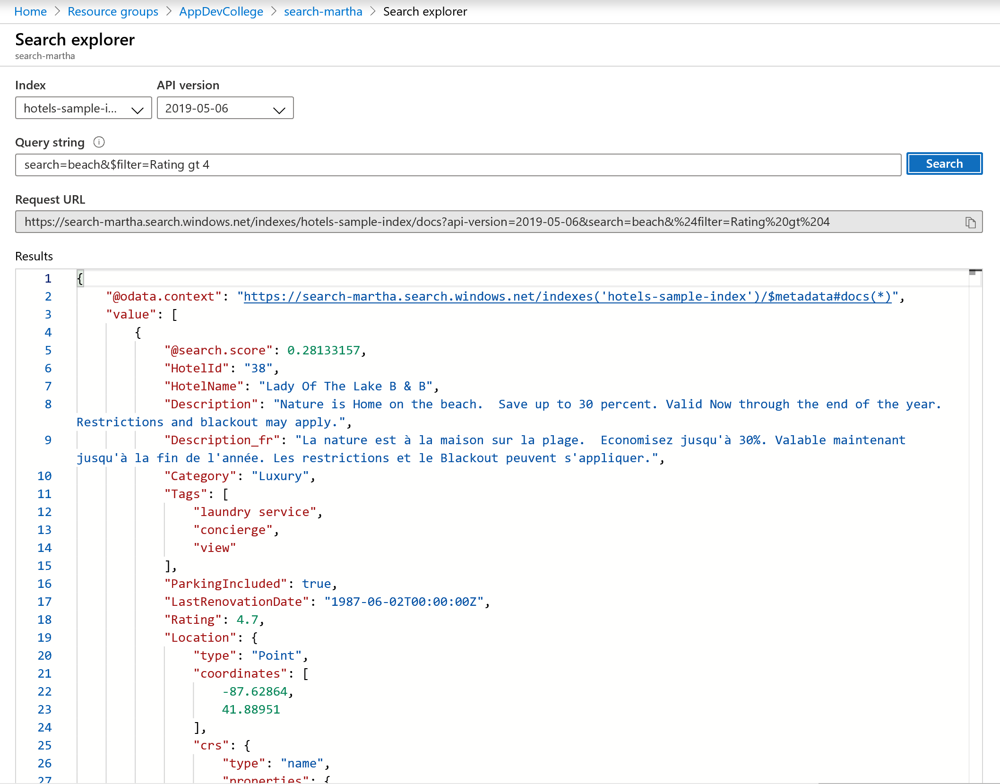

#### Linguistic Analysis Query: `search=beaches&highlight=Description`

* Full text search recognizes basic variations in word forms. In this case, search results contain highlighted text for "beach", for hotels that have that word in their searchable fields, in response to a keyword search on "beaches". Different forms of the same word can appear in results because of linguistic analysis. 

* Azure Cognitive Search supports 56 analyzers from both Lucene and Microsoft. The default used by Azure Cognitive Search is the standard Lucene analyzer.

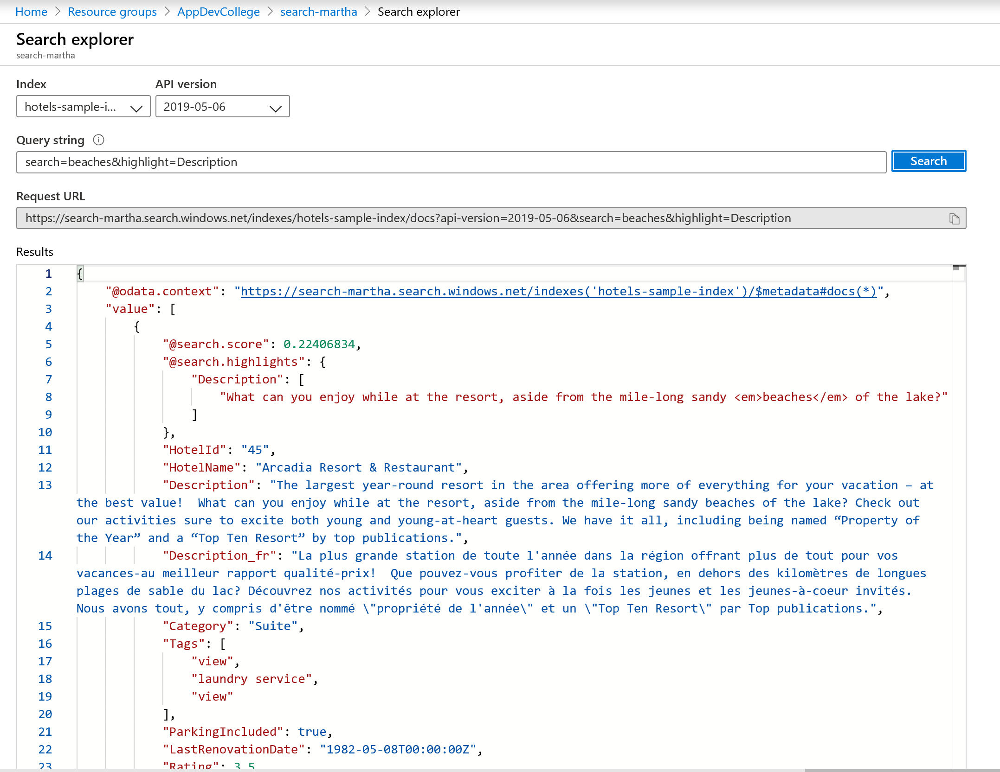

### <a name="fuzzy-search"></a> Try fuzzy search

By default, misspelled query terms, like *seatle* for "Seattle", fail to return matches in typical search. The following example returns no results.

#### Example (misspelled term, unhandled): `search=seatle`

To handle misspellings, you can use fuzzy search. Fuzzy search is enabled when you use the full Lucene query syntax, which occurs when you do two things: set **queryType=full** on the query, and append the **~** to the search string.

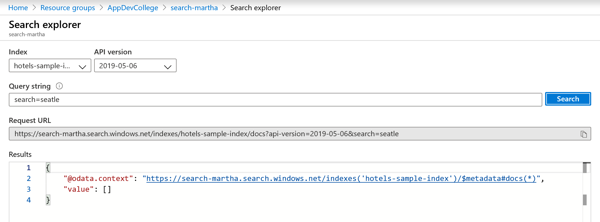

#### Example (misspelled term, handled): `search=seatle~&queryType=full`

This example now returns documents that include matches on "Seattle".

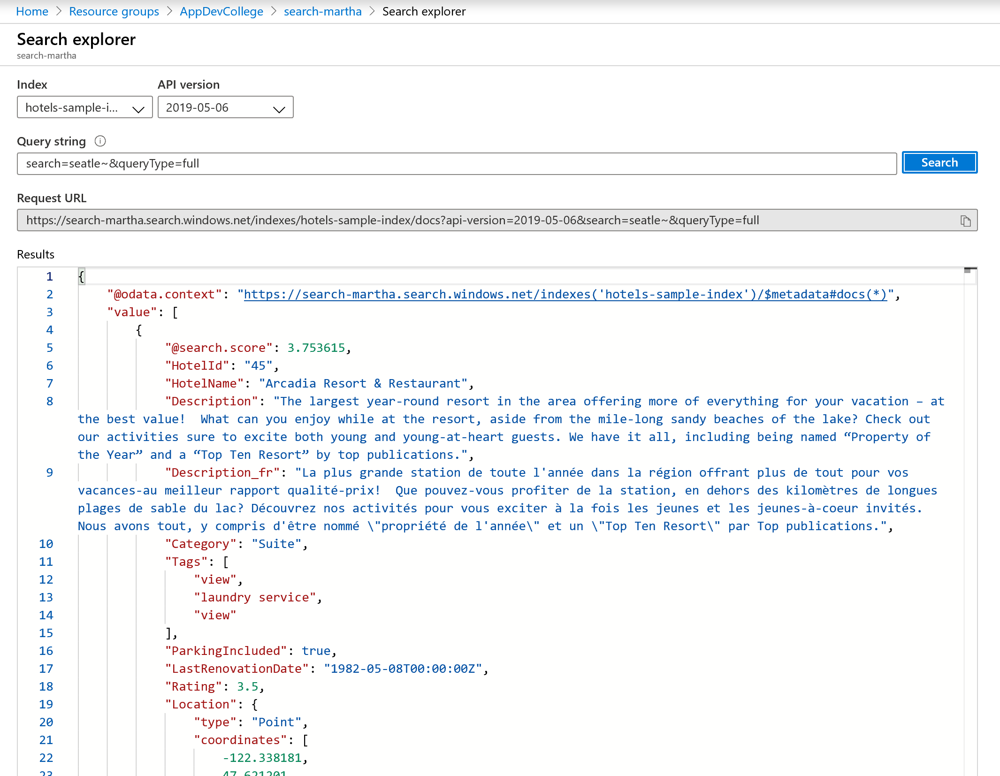

When **queryType** is unspecified, the default simple query parser is used. The simple query parser is faster, but if you require fuzzy search, regular expressions, proximity search, or other advanced query types, you will need the full syntax.

Fuzzy search and wildcard search have implications on search output. Linguistic analysis is not performed on these query formats. Before using fuzzy and wildcard search, review [How full text search works in Azure Cognitive Search](https://docs.microsoft.com/en-us/azure/search/query-lucene-syntax) and look for the section about exceptions to lexical analysis.

For more information about query scenarios enabled by the full query parser, see [Lucene query syntax in Azure Cognitive Search](https://docs.microsoft.com/rest/api/searchservice/lucene-query-syntax-in-azure-search).

[Full List of Example Queries](https://docs.microsoft.com/en-us/azure/search/search-get-started-portal#example-queries)
[Lucene Syntax](https://docs.microsoft.com/en-us/azure/search/search-query-lucene-examples)

# Add Cognitive Skills to Azure Search - to index unstructured content (e.g. images, audio, etc.)

[Azure Cognitive Search](https://docs.microsoft.com/en-us/azure/search/cognitive-search-concept-intro) allows us to also index unstructured data. More precisely, it add capabilities for data extraction, natural language processing (NLP), and image processing to Azure Search indexing pipeline (for more see [here](https://docs.microsoft.com/en-us/azure/search/cognitive-search-concept-intro#key-features-and-concepts)). In Azure Cognitive Search, a skillset responsible for the pipeline of the data and consists of multiple skills. Some skills have been pre-included, but it is also possible for us to write our own skills.

[Azure Cognitive Search](https://docs.microsoft.com/en-us/azure/search/cognitive-search-quickstart-blob)

As before, let's choose the Sample dataset and choose the SQL DB `realestate-us-sample`.

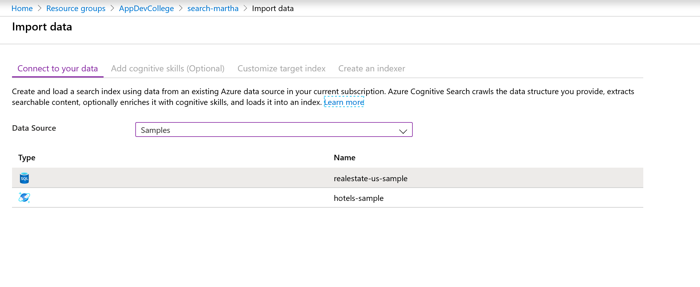

Once we're done, we'll repeat the steps from before, `Import Dataset`, walk through the wizard, but this time, we'll configure the `Cognitive Search` part in the second tab.

Next, we need to define the skillset. In our case, we'll enable all features:

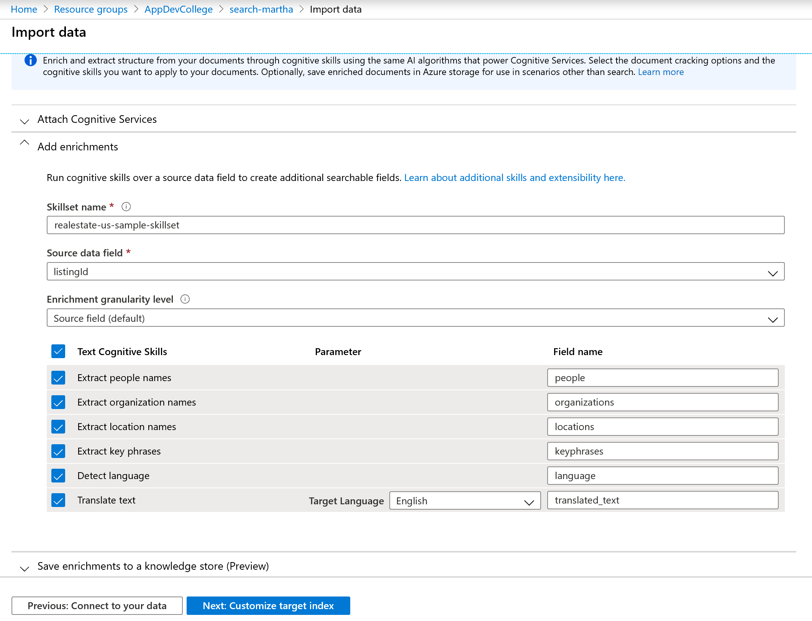

Once we finished the next two tabs, Azure Cognitive Search will start indexing our data (this will take a bit longer, as it needs to run image recognition, OCR, etc. on the files).

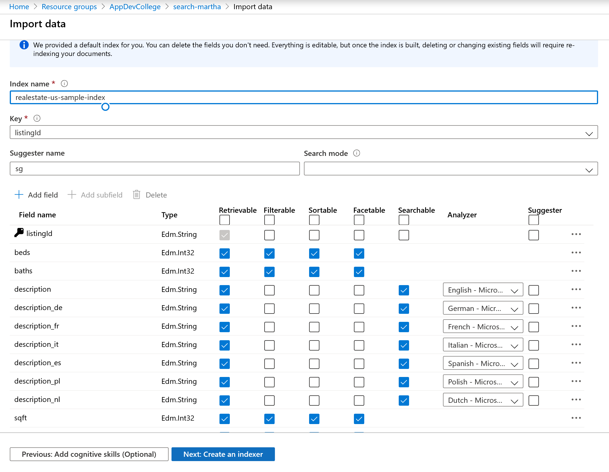

In the following JSON we can see that the cognitive skills are enabled and that the Translate Skill has a result:

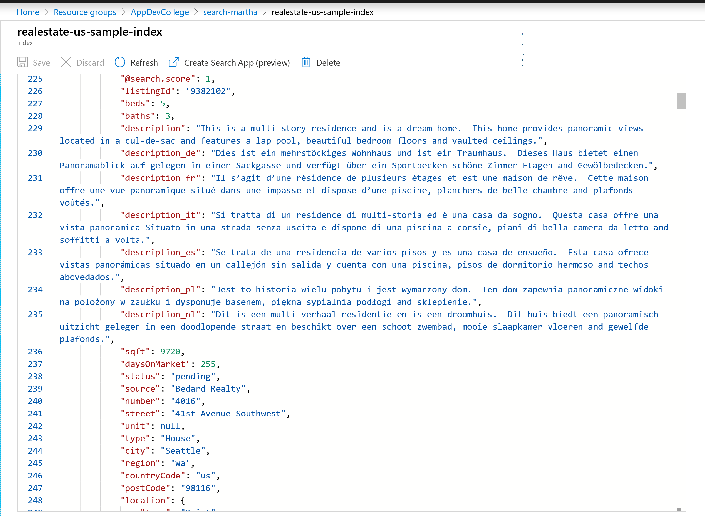

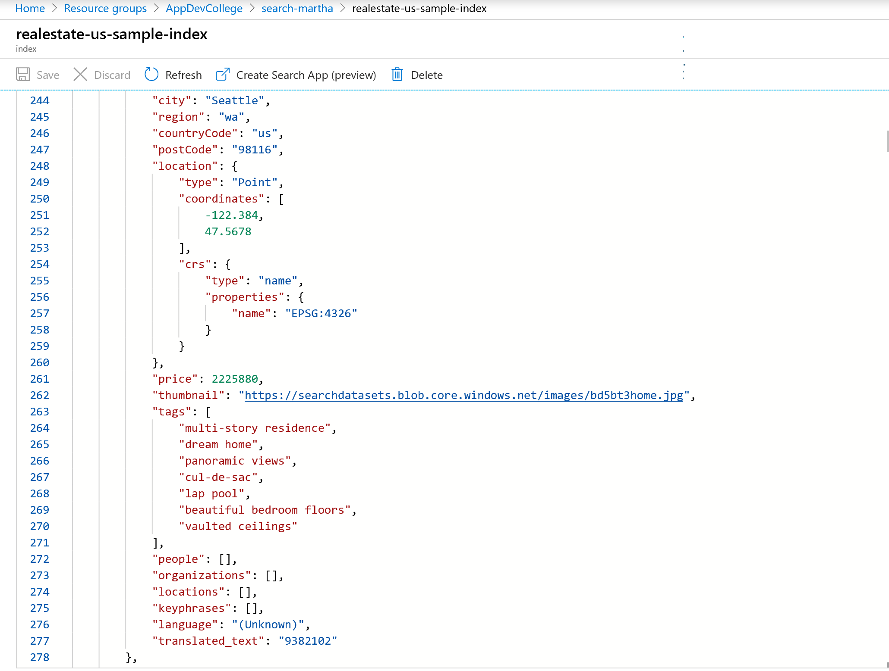

* [Simple Query Syntax](https://docs.microsoft.com/en-us/rest/api/searchservice/simple-query-syntax-in-azure-search)
* [Lucene Query Syntax](https://docs.microsoft.com/en-us/rest/api/searchservice/lucene-query-syntax-in-azure-search)

## Using the API

We've been lazy and did everything through the portal - obviously not the way we want to work in the real world. Especially data ingestion and search should (and most likely needs) to be performed through the API:

* [Create an index](https://docs.microsoft.com/en-us/azure/search/search-create-index-rest-api)
* [Import Data](https://docs.microsoft.com/en-us/azure/search/search-import-data-rest-api)
* [Search](https://docs.microsoft.com/en-us/azure/search/search-query-rest-api)

# Integrate Azure Search in an Node JS Application

Now let's jump into Code. We will create a Node.js application that that creates, loads, and queries an Azure Cognitive Search index. This article demonstrates how to create the application step-by-step. 

## Set up your environment

Begin by opening the Cloud Shell in the Browser, a Bash console, Powershell console or other environment in which you've installed Node.js.

1. Create a development directory, giving it the name `devcollege` :

    ```bash
    md devcollege
    cd devcollege
    git clone https://github.com/Azure-Samples/azure-search-javascript-samples.git
    cd azure-search-javascript-samples
    code .
    ```
    Open Terminal in VS Code and run npm init

2. Initialize an empty project with NPM by running `npm init`. Accept the default values, except for the License, which you should set to "MIT". 

3. Add packages that will be depended on by the code and aid in development:

    ```bash
    npm install nconf node-fetch
    npm install --save-dev eslint eslint-config-prettier eslint-config-airbnb-base eslint-plugin-import prettier
    ```

4. Confirm that you've configured the projects and its dependencies by checking that your  **package.json** file looks similar to the following:

    ```json
    {
      "name": "quickstart",
      "version": "1.0.0",
      "description": "Azure Cognitive Search Quickstart",
      "main": "index.js",
      "scripts": {
        "test": "echo \"Error: no test specified\" && exit 1"
      },
      "keywords": [
        "Azure",
        "Azure_Search"
      ],
      "author": "Your Name",
      "license": "MIT",
      "dependencies": {
        "nconf": "^0.10.0",
        "node-fetch": "^2.6.0"
      },
      "devDependencies": {
        "eslint": "^6.1.0",
        "eslint-config-airbnb-base": "^13.2.0",
        "eslint-config-prettier": "^6.0.0",
        "eslint-plugin-import": "^2.18.2",
        "prettier": "^1.18.2"
      }
    }
    ```
Insert your search service data in the file **azure_search_config.json** :

```json
{
    "serviceName" : "<SERVICE_NAME>",
    "adminKey" : "<SEARCH_SERVICE_ADMIN_KEY>",
    "queryKey" : "<QUERY_KEY>",
    "indexName" : "hotels-quickstart"
}
```

Replace the `[SERVICE_NAME]` value with the name of your search service. Replace `[ADMIN_KEY]` and `[QUERY_KEY]` with the key values you recorded earlier.  If your endpoint URL were https://mydemo.search.windows.net, your service name would be mydemo.


In Settings > Keys, get an admin key for full rights on the service. There are two interchangeable admin keys, provided for business continuity in case you need to roll one over. You can use either the primary or secondary key on requests for adding, modifying, and deleting objects.

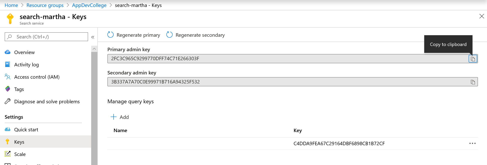

Get the query key as well. It's a best practice to issue query requests with read-only access.

## 1 - Create index 

Find the file **hotels_quickstart_index.json**.  This file defines how Azure Cognitive Search works with the documents you'll be loading in the next step. Each field will be identified by a `name` and have a specified `type`. Each field also has a series of index attributes that specify whether Azure Cognitive Search can search, filter, sort, and facet upon the field. 

Most of the fields are simple data types, but some, like `AddressType` are complex types that allow you to create rich data structures in your index.  You can read more about [supported data types](https://docs.microsoft.com/rest/api/searchservice/supported-data-types) and [index attributes](https://docs.microsoft.com/azure/search/search-what-is-an-index#index-attributes). 

Replace the following to **hotels_quickstart_index.json** or [download the file](https://github.com/Azure-Samples/azure-search-javascript-samples/blob/master/quickstart/hotels_quickstart_index.json). 

```json
{
    "name": "hotels-quickstart",
    "fields": [
        {
            "name": "HotelId",
            "type": "Edm.String",
            "key": true,
            "filterable": true
        },
        {
            "name": "HotelName",
            "type": "Edm.String",
            "searchable": true,
            "filterable": false,
            "sortable": true,
            "facetable": false
        },
        {
            "name": "Description",
            "type": "Edm.String",
            "searchable": true,
            "filterable": false,
            "sortable": false,
            "facetable": false,
            "analyzer": "en.lucene"
        },
        {
            "name": "Description_fr",
            "type": "Edm.String",
            "searchable": true,
            "filterable": false,
            "sortable": false,
            "facetable": false,
            "analyzer": "fr.lucene"
        },
        {
            "name": "Category",
            "type": "Edm.String",
            "searchable": true,
            "filterable": true,
            "sortable": true,
            "facetable": true
        },
        {
            "name": "Tags",
            "type": "Collection(Edm.String)",
            "searchable": true,
            "filterable": true,
            "sortable": false,
            "facetable": true
        },
        {
            "name": "ParkingIncluded",
            "type": "Edm.Boolean",
            "filterable": true,
            "sortable": true,
            "facetable": true
        },
        {
            "name": "LastRenovationDate",
            "type": "Edm.DateTimeOffset",
            "filterable": true,
            "sortable": true,
            "facetable": true
        },
        {
            "name": "Rating",
            "type": "Edm.Double",
            "filterable": true,
            "sortable": true,
            "facetable": true
        },
        {
            "name": "Address",
            "type": "Edm.ComplexType",
            "fields": [
                {
                    "name": "StreetAddress",
                    "type": "Edm.String",
                    "filterable": false,
                    "sortable": false,
                    "facetable": false,
                    "searchable": true
                },
                {
                    "name": "City",
                    "type": "Edm.String",
                    "searchable": true,
                    "filterable": true,
                    "sortable": true,
                    "facetable": true
                },
                {
                    "name": "StateProvince",
                    "type": "Edm.String",
                    "searchable": true,
                    "filterable": true,
                    "sortable": true,
                    "facetable": true
                },
                {
                    "name": "PostalCode",
                    "type": "Edm.String",
                    "searchable": true,
                    "filterable": true,
                    "sortable": true,
                    "facetable": true
                },
                {
                    "name": "Country",
                    "type": "Edm.String",
                    "searchable": true,
                    "filterable": true,
                    "sortable": true,
                    "facetable": true
                }
            ]
        }
    ],
    "suggesters": [
        {
            "name": "sg",
            "searchMode": "analyzingInfixMatching",
            "sourceFields": [
                "HotelName"
            ]
        }
    ]
}
```
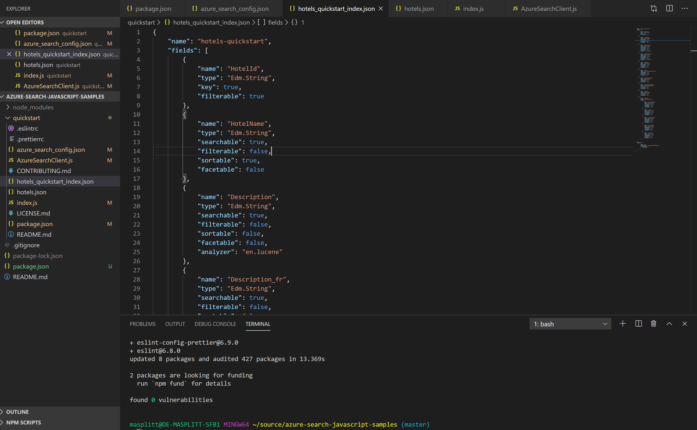

It's good practice to separate the specifics of a particular scenario from code that will be broadly applicable. The `AzureSearchClient` class defined in the file **AzureSearchClient.js** will know how to construct request URLs, make a request using the Fetch API, and react to the status code of the response.

Begin working on **AzureSearchClient.js** by importing the **node-fetch** package and creating a simple class. Isolate the changeable parts of the `AzureSearchClient` class by passing to its constructor the various configuration values:

```javascript
const fetch = require('node-fetch');

class AzureSearchClient {
    constructor(searchServiceName, adminKey, queryKey, indexName) {
        this.searchServiceName = searchServiceName;
        this.adminKey = adminKey;
        // The query key is used for read-only requests and so can be distributed with less risk of abuse.
        this.queryKey = queryKey;
        this.indexName = indexName;
        this.apiVersion = '2019-05-06';
    }

    // All methods go inside class body here!
}

module.exports = AzureSearchClient;
```

The first responsibility of the class is to know how to construct URLs to which to send the various requests. Build these URLs with instance methods that use the configuration data passed to the class constructor. Notice that the URL they construct is specific to an API version and must have an argument specifying that version (in this application, `2019-05-06`). 

The first of these methods will return the URL for the index itself. Add the following method inside the class body:

```javascript
getIndexUrl() { return `https://${this.searchServiceName}.search.windows.net/indexes/${this.indexName}?api-version=${this.apiVersion}`; }

```

The next responsibility of `AzureSearchClient` is making an asynchronous request with the Fetch API. The asynchronous static method `request` takes a URL, a string specifying the HTTP method ("GET", "PUT", "POST", "DELETE"), the key to be used in the request, and an optional JSON object. 

The `headers` variable maps the `queryKey` (whether the admin key or the read-only query key) to the "api-key" HTTP request header. The request options always contain the `method` to be used and the `headers`. If `bodyJson` isn't `null`, the body of the HTTP request is set to the string representation of `bodyJson`. The `request` method returns the Fetch API's Promise to execute the HTTP request.

```javascript
static async request(url, method, apiKey, bodyJson = null) {
    // Uncomment the following for request details:
    /*
    console.log(`\n${method} ${url}`);
    console.log(`\nKey ${apiKey}`);
    if (bodyJson !== null) {
        console.log(`\ncontent: ${JSON.stringify(bodyJson, null, 4)}`);
    }
    */

    const headers = {
        'content-type' : 'application/json',
        'api-key' : apiKey
    };
    const init = bodyJson === null ?
        { 
            method, 
            headers
        }
        : 
        {
            method, 
            headers,
            body : JSON.stringify(bodyJson)
        };
    return fetch(url, init);
}
```

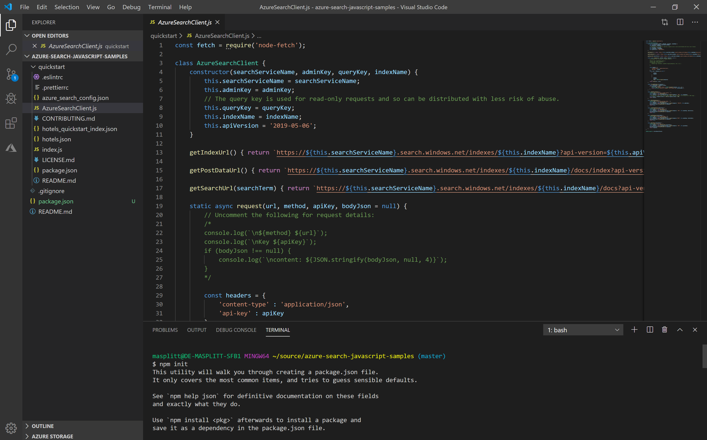

For demo purposes, just throw an exception if the HTTP request is not a success. In a real application, you would probably do some logging and diagnosis of the HTTP status code in the `response` from the search service request. 
    
```javascript
static throwOnHttpError(response) {
    const statusCode = response.status;
    if (statusCode >= 300){
        console.log(`Request failed: ${JSON.stringify(response, null, 4)}`);
        throw new Error(`Failure in request. HTTP Status was ${statusCode}`);
    }
}
```

Finally, add the methods to detect, delete, and create the Azure Cognitive Search index. These methods all have the same structure:

* Get the endpoint to which the request will be made.
* Generate the request with the appropriate endpoint, HTTP verb, API key, and, if appropriate, a JSON body. `indexExistsAsync()` and `deleteIndexAsync()` do not have a JSON body, but `createIndexAsync(definition)` does.
* `await` the response to the request.  
* Act on the status code of the response.
* Return a Promise of some appropriate value (a Boolean, `this`, or the query results). 

```javascript
async indexExistsAsync() { 
    console.log("\n Checking if index exists...");
    const endpoint = this.getIndexUrl();
    const response = await AzureSearchClient.request(endpoint, "GET", this.adminKey);
    // Success has a few likely status codes: 200 or 204 (No Content), but accept all in 200 range...
    const exists = response.status >= 200 && response.status < 300;
    return exists;
}

async deleteIndexAsync() {
    console.log("\n Deleting existing index...");
    const endpoint = this.getIndexUrl();
    const response = await AzureSearchClient.request(endpoint, "DELETE", this.adminKey);
    AzureSearchClient.throwOnHttpError(response);
    return this;
}

async createIndexAsync(definition) {
    console.log("\n Creating index...");
    const endpoint = this.getIndexUrl();
    const response = await AzureSearchClient.request(endpoint, "PUT", this.adminKey, definition);
    AzureSearchClient.throwOnHttpError(response);
    return this;
}
```

Confirm that your methods are inside the class and that you're exporting the class. The outermost scope of **AzureSearchClient.js** should be:

```javascript
const fetch = require('node-fetch');

class AzureSearchClient {
    // ... code here ...
}

module.exports = AzureSearchClient;
```

An object-oriented class was a good choice for the potentially reusable **AzureSearchClient.js** module, but isn't necessary for the main program, which you should put in a file called **index.js**. 

Create **index.js** and begin by bringing in:

* The **nconf** package, which gives you flexibility for specifying the configuration with JSON, environment variables, or command-line arguments.
* The data from the **hotels_quickstart_index.json** file.
* The `AzureSearchClient` module.

```javascript
const nconf = require('nconf');

const indexDefinition = require('./hotels_quickstart_index.json');
const AzureSearchClient = require('./AzureSearchClient.js');
```

The [**nconf** package](https://github.com/indexzero/nconf) allows you to specify configuration data in a variety of formats, such as environment variables or the command line. This sample uses **nconf** in a basic manner to read the file **azure_search_config.json** and return that file's contents as a dictionary. Using **nconf**'s `get(key)` function, you can do a quick check that the configuration information has been properly customized. Finally, the function returns the configuration:

```javascript
function getAzureConfiguration() {
    const config = nconf.file({ file: 'azure_search_config.json' });
    if (config.get('serviceName') === '<SEARCH_SERVICE_NAME>' ) {
        throw new Error("You have not set the values in your azure_search_config.json file. Change them to match your search service's values.");
    }
    return config;
}
```

The `sleep` function creates a `Promise` that resolves after a specified amount of time. Using this function allows the app to pause while waiting for asynchronous index operations to complete and become available. Adding such a delay is typically only necessary in demos, tests, and sample applications.

```javascript
function sleep(ms) {
    return(
        new Promise(function(resolve, reject) {
            setTimeout(function() { resolve(); }, ms);
        })
    );
}
```

Finally, specify and call the main asynchronous `run` function. This function calls the other functions in order, awaiting as necessary to resolve `Promise`s.

* Retrieve the configuration with the `getAzureConfiguration()` you wrote previously
* Create a new `AzureSearchClient` instance, passing in values from your configuration
* Check if the index exists and, if it does, delete it
* Create an index using the `indexDefinition` loaded from **hotels_quickstart_index.json**

```javascript
const run = async () => {
    try {
        const cfg = getAzureConfiguration();
        const client = new AzureSearchClient(cfg.get("serviceName"), cfg.get("adminKey"), cfg.get("queryKey"), cfg.get["serviceName"]);
        
        const exists = await client.indexExistsAsync();
        await exists ? client.deleteIndexAsync() : Promise.resolve();
        // Deleting index can take a few seconds
        await sleep(2000);
        await client.createIndexAsync(indexDefinition);
    } catch (x) {
        console.log(x);
    }
}

run();
```

Don't forget that final call to `run()`! It's the entrance point to your program when you run `node index.js` in the next step.

Notice that `AzureSearchClient.indexExistsAsync()` and `AzureSearchClient.deleteIndexAsync()` do not take parameters. These functions call `AzureSearchClient.request()` with no `bodyJson` argument. Within `AzureSearchClient.request()`, since `bodyJson === null` is `true`, the `init` structure is set to be just the HTTP verb ("GET" for `indexExistsAsync()` and "DELETE" for `deleteIndexAsync()`) and the headers, which specify the request key.  

In contrast, the `AzureSearchClient.createIndexAsync(indexDefinition)` method _does_ take a parameter. The `run` function in `index.js`, passes the contents of the file **hotels_quickstart_index.json** to the `AzureSearchClient.createIndexAsync(indexDefinition)` method. The `createIndexAsync()` method passes this definition to `AzureSearchClient.request()`. In `AzureSearchClient.request()`, since `bodyJson === null` is now `false`, the `init` structure includes not only the HTTP verb ("PUT") and the headers, but sets the `body` to the index definition data.

### Prepare and run the sample

Use a terminal window for the following commands.

1. Navigate to the folder that contains the **package.json** file and the rest of your code.
2. Install the packages for the sample with `npm install`.  This command will download the packages upon which the code depends.
3. Run your program with `node index.js`.

You should see a series of messages describing the actions being taken by the program. If you want to see more detail of the requests, you can uncomment the [lines at the beginning of the `AzureSearchClient.request()` method]https://github.com/Azure-Samples/azure-search-javascript-samples/blob/master/quickstart/AzureSearchClient.js#L21-L27) in **AzureSearchClient.js**. 

## 2 - Load Documents 

In Azure Cognitive Search, documents are data structures that are both inputs to indexing and outputs from queries. You need to POST such data to the index. This uses a different endpoint than the operations done in the previous step. Open **AzureSearchClient.js** and add the following method after `getIndexUrl()`:

```javascript
 getPostDataUrl() { return `https://${this.searchServiceName}.search.windows.net/indexes/${this.indexName}/docs/index?api-version=${this.apiVersion}`;  }
```

Like `AzureSearchClient.createIndexAsync(definition)`, you need a function that calls `AzureSearchClient.request()` and passes in the hotel data to be its body. In **AzureSearchClient.js** add `postDataAsync(hotelsData)` after `createIndexAsync(definition)`:

```javascript
async postDataAsync(hotelsData) {
    console.log("\n Adding hotel data...");
    const endpoint = this.getPostDataUrl();
    const response = await AzureSearchClient.request(endpoint,"POST", this.adminKey, hotelsData);
    AzureSearchClient.throwOnHttpError(response);
    return this;
}
```

 Document inputs might be rows in a database, blobs in Blob storage, or, as in this sample, JSON documents on disk. You can either download [hotels.json](https://github.com/Azure-Samples/azure-search-javascript-samples/blob/master/quickstart/hotels.json) or create your own **hotels.json** file with the following content:

```json
{
    "value": [
        {
            "HotelId": "1",
            "HotelName": "Secret Point Motel",
            "Description": "The hotel is ideally located on the main commercial artery of the city in the heart of New York. A few minutes away is Time's Square and the historic centre of the city, as well as other places of interest that make New York one of America's most attractive and cosmopolitan cities.",
            "Description_fr": "L'hôtel est idéalement situé sur la principale artère commerciale de la ville en plein cœur de New York. A quelques minutes se trouve la place du temps et le centre historique de la ville, ainsi que d'autres lieux d'intérêt qui font de New York l'une des villes les plus attractives et cosmopolites de l'Amérique.",
            "Category": "Boutique",
            "Tags": ["pool", "air conditioning", "concierge"],
            "ParkingIncluded": false,
            "LastRenovationDate": "1970-01-18T00:00:00Z",
            "Rating": 3.6,
            "Address": {
                "StreetAddress": "677 5th Ave",
                "City": "New York",
                "StateProvince": "NY",
                "PostalCode": "10022"
            }
        },
        {
            "HotelId": "2",
            "HotelName": "Twin Dome Motel",
            "Description": "The hotel is situated in a  nineteenth century plaza, which has been expanded and renovated to the highest architectural standards to create a modern, functional and first-class hotel in which art and unique historical elements coexist with the most modern comforts.",
            "Description_fr": "L'hôtel est situé dans une place du XIXe siècle, qui a été agrandie et rénovée aux plus hautes normes architecturales pour créer un hôtel moderne, fonctionnel et de première classe dans lequel l'art et les éléments historiques uniques coexistent avec le confort le plus moderne.",
            "Category": "Boutique",
            "Tags": ["pool", "free wifi", "concierge"],
            "ParkingIncluded": "false",
            "LastRenovationDate": "1979-02-18T00:00:00Z",
            "Rating": 3.6,
            "Address": {
                "StreetAddress": "140 University Town Center Dr",
                "City": "Sarasota",
                "StateProvince": "FL",
                "PostalCode": "34243"
            }
        },
        {
            "HotelId": "3",
            "HotelName": "Triple Landscape Hotel",
            "Description": "The Hotel stands out for its gastronomic excellence under the management of William Dough, who advises on and oversees all of the Hotel’s restaurant services.",
            "Description_fr": "L'hôtel est situé dans une place du XIXe siècle, qui a été agrandie et rénovée aux plus hautes normes architecturales pour créer un hôtel moderne, fonctionnel et de première classe dans lequel l'art et les éléments historiques uniques coexistent avec le confort le plus moderne.",
            "Category": "Resort and Spa",
            "Tags": ["air conditioning", "bar", "continental breakfast"],
            "ParkingIncluded": "true",
            "LastRenovationDate": "2015-09-20T00:00:00Z",
            "Rating": 4.8,
            "Address": {
                "StreetAddress": "3393 Peachtree Rd",
                "City": "Atlanta",
                "StateProvince": "GA",
                "PostalCode": "30326"
            }
        },
        {
            "HotelId": "4",
            "HotelName": "Sublime Cliff Hotel",
            "Description": "Sublime Cliff Hotel is located in the heart of the historic center of Sublime in an extremely vibrant and lively area within short walking distance to the sites and landmarks of the city and is surrounded by the extraordinary beauty of churches, buildings, shops and monuments. Sublime Cliff is part of a lovingly restored 1800 palace.",
            "Description_fr": "Le sublime Cliff Hotel est situé au coeur du centre historique de sublime dans un quartier extrêmement animé et vivant, à courte distance de marche des sites et monuments de la ville et est entouré par l'extraordinaire beauté des églises, des bâtiments, des commerces et Monuments. Sublime Cliff fait partie d'un Palace 1800 restauré avec amour.",
            "Category": "Boutique",
            "Tags": ["concierge", "view", "24-hour front desk service"],
            "ParkingIncluded": true,
            "LastRenovationDate": "1960-02-06T00:00:00Z",
            "Rating": 4.6,
            "Address": {
                "StreetAddress": "7400 San Pedro Ave",
                "City": "San Antonio",
                "StateProvince": "TX",
                "PostalCode": "78216"
            }
        }
    ]
}

```

To load this data into your program, modify **index.js** by adding the line referring to `hotelData` near the top:

```javascript
const nconf = require('nconf');

const hotelData = require('./hotels.json');
const indexDefinition = require('./hotels_quickstart_index.json');
```

Now modify the `run()` function in **index.js**. It can take a few seconds for the index to become available, so add a 2-second pause before calling `AzureSearchClient.postDataAsync(hotelData)`:

```javascript
const run = async () => {
    try {
        const cfg = getAzureConfiguration();
        const client = new AzureSearchClient(cfg.get("serviceName"), cfg.get("adminKey"), cfg.get("queryKey"), cfg.get("indexName"));
        
        const exists = await client.indexExistsAsync();
        await exists ? client.deleteIndexAsync() : Promise.resolve();
        // Deleting index can take a few seconds
        await sleep(2000);
        await client.createIndexAsync(indexDefinition);
        // Index availability can take a few seconds
        await sleep(2000);
        await client.postDataAsync(hotelData);
    } catch (x) {
        console.log(x);
    }
}
```

Run the program again with `node index.js`. You should see a slightly different set of messages from those you saw in Step 1. This time, the index _does_ exist, and you should see message about deleting it before the app creates the new index and posts data to it. 

## 3 - Search an index

Return to the **Indexes** tab in the **Overview** of your search service on the Azure portal. Your index now contains four documents and consumes some amount of storage (it may take a few minutes for the UI to properly reflect the underlying state of the index). Click on the index name to be taken to the **Search Explorer**. This page allows you to experiment with data queries. Try searching on a query string of `*&$count=true` and you should get back all your documents and the number of results. Try with the query string `historic&highlight=Description&$filter=Rating gt 4` and you should get back a single document, with the word "historic" wrapped in `<em></em>` tags. Read more about [how to compose a query in Azure Cognitive Search](https://docs.microsoft.com/azure/search/search-query-overview). 

Reproduce these queries in code by opening **index.js** and adding this code near the top:

```javascript
const queries = [
    "*&$count=true",
    "historic&highlight=Description&$filter=Rating gt 4&"
];
```

In the same **index.js** file, write the `doQueriesAsync()` function shown below. This function takes an `AzureSearchClient` object and applies the `AzureSearchClient.queryAsync` method to each of the values in the `queries` array. It uses the `Promise.all()` function to return a single `Promise` that only resolves when all of the queries have resolved. The call to `JSON.stringify(body, null, 4)` formats the query result to be more readable.

```javascript
async function doQueriesAsync(client) {
    return Promise.all(
        queries.map( async query => {
            const result = await client.queryAsync(query);
            const body = await result.json();
            const str = JSON.stringify( body, null, 4);
            console.log(`Query: ${query} \n ${str}`);
        })
    );
}
```

Modify the `run()` function to pause long enough for the indexer to work and then to call the `doQueriesAsync(client)` function:

```javascript
const run = async () => {
    try {
        const cfg = getAzureConfiguration();
        const client = new AzureSearchClient(cfg.get("serviceName"), cfg.get("adminKey"), cfg.get("queryKey"), cfg.get("indexName"));
        
        const exists = await client.indexExistsAsync();
        await exists ? client.deleteIndexAsync() : Promise.resolve();
        // Deleting index can take a few seconds
        await sleep(2000);
        await client.createIndexAsync(indexDefinition);
        // Index availability can take a few seconds
        await sleep(2000);
        await client.postDataAsync(hotelData);
        // Data availability can take a few seconds
        await sleep(5000);
        await doQueriesAsync(client);
    } catch (x) {
        console.log(x);
    }
}
```

To implement `AzureSearchClient.queryAsync(query)`, edit the file **AzureSearchClient.js**. Searching requires a different endpoint, and the search terms become URL arguments, so add the function `getSearchUrl(searchTerm)` alongside the `getIndexUrl()` and `getPostDataUrl()` methods you've already written.

```javascript
getSearchUrl(searchTerm) { return `https://${this.searchServiceName}.search.windows.net/indexes/${this.indexName}/docs?api-version=${this.apiVersion}&search=${searchTerm}&searchMode=all`; }
 ```

The `queryAsync(searchTerm)` function also goes in **AzureSearchClient.js** and follows the same structure as `postDataAsync(data)` and the other querying functions: 

```javascript
async queryAsync(searchTerm) {
    console.log("\n Querying...")
    const endpoint = this.getSearchUrl(searchTerm);
    const response = await AzureSearchClient.request(endpoint, "GET", this.queryKey);
    AzureSearchClient.throwOnHttpError(response);
    return response;
}
```

Search is done with the "GET" verb and no body, since the search term is part of the URL. Notice that `queryAsync(searchTerm)` uses `this.queryKey`, unlike the other functions that used the admin key. Query keys, as the name implies, can only be used for querying the index and can't be used to modify the index in any way. Query keys are therefore safer to distribute to client applications.

Run the program with `node index.js`. Now, in addition to the previous steps, the queries will be sent and the results written to the console. Make sure to change the directory (cd) into the right folder where the index.js file is located. Below you can see a (part of the) screenshot of the possible result:

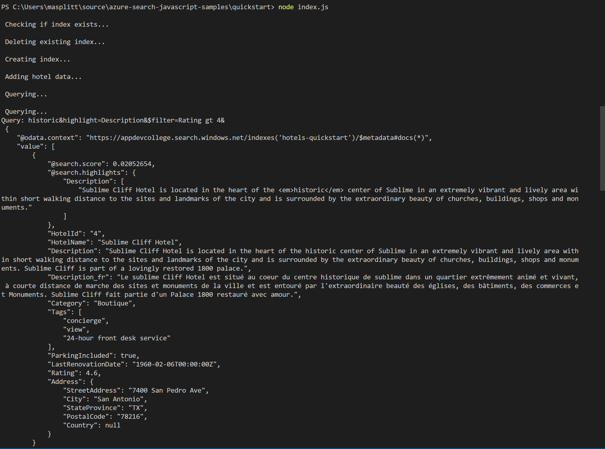

### About the sample

The sample uses a small amount of hotel data, sufficient to demonstrate the basics of creating and querying an Azure Cognitive Search index.

The **AzureSearchClient** class encapsulates the configuration, URLs, and basic HTTP requests for the search service. The **index.js** file loads the configuration data for the Azure Cognitive Search service, the hotel data that will be uploaded for indexing, and, in its `run` function, orders, and executes the various operations.

The overall behavior of the `run` function is to delete the Azure Cognitive Search index if it exists, create the index, add some data, and perform some queries.  

# House Keeping: Lab Cleanup

### Use Azure CLI to Delete Resource Group

1. In the **Cloud Shell** command prompt at the bottom of the portal, type in the following command and press **Enter** to list all resource groups in the subscription:

    ```sh
    az group list
    ```

2. Type in the following command and press **Enter** to delete the **yourResourceGroup** *Resource Group*:

    ```sh
    az group delete --name "yourResourceGroup" --no-wait --yes
    ```

3. Close the **Cloud Shell** prompt at the bottom of the portal.

4. Close your browser application.


# Optional Add On for those who want to get to know Python ##

## Create an Azure Cognitive Search index in Python using Jupyter notebooks ##

## Get a key and URL

REST calls require the service URL and an access key on every request. A search service is created with both, so if you added Azure Cognitive Search to your subscription, follow these steps to get the necessary information:

1. [Sign in to the Azure portal](https://portal.azure.com/), and in your search service **Overview** page, get the URL. An example endpoint might look like `https://mydemo.search.windows.net`.

2. In **Settings** > **Keys**, get an admin key for full rights on the service. There are two interchangeable admin keys, provided for business continuity in case you need to roll one over. You can use either the primary or secondary key on requests for adding, modifying, and deleting objects.

All requests require an api-key on every request sent to your service. Having a valid key establishes trust, on a per request basis, between the application sending the request and the service that handles it.

## Connect to Azure Cognitive Search

In this task, start a Jupyter notebook and verify that you can connect to Azure Cognitive Search. You'll do this by requesting a list of indexes from your service. On Windows with Anaconda3, you can use Anaconda Navigator to launch a notebook.

0. Register here [Azure Notebooks](https://notebooks.azure.com)
1. Create a project 
    

    

2. Create a notebook
   

3. Create a new Python3.6 notebook.
   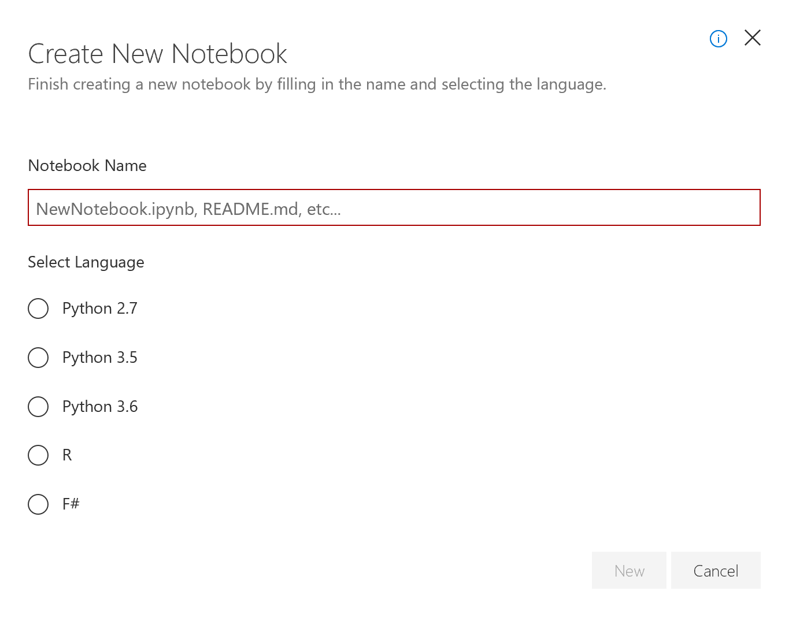

4. In the first cell, load the libraries used for working with JSON and formulating HTTP requests.

   ```python
   import json
   import requests
   from pprint import pprint
   ```

5. In the second cell, input the request elements that will be constants on every request. Replace the search service name (YOUR-SEARCH-SERVICE-NAME) and admin API key (YOUR-ADMIN-API-KEY) with valid values. 

   ```python
   endpoint = 'https://<YOUR-SEARCH-SERVICE-NAME>.search.windows.net/'
   api_version = '?api-version=2019-05-06'
   headers = {'Content-Type': 'application/json',
           'api-key': '<YOUR-ADMIN-API-KEY>' }
   ```

   If you get ConnectionError `"Failed to establish a new connection"`, verify that the api-key is a primary or secondary admin key, and that all leading and trailing characters (`?` and `/`) are in place.

6. In the third cell, formulate the request. This GET request targets the indexes collection of your search service and selects the name property of existing indexes.

   ```python
   url = endpoint + "indexes" + api_version + "&$select=name"
   response  = requests.get(url, headers=headers)
   index_list = response.json()
   pprint(index_list)
   ```

7. Run each step. If indexes exist, the response contains a list of index names. In the screenshot below, the service already has an azureblob-index and a realestate-us-sample index.

   In contrast, an empty index collection returns this response: `{'@odata.context': 'https://mydemo.search.windows.net/$metadata#indexes(name)', 'value': []}`

## 1 - Create an index

Unless you are using the portal, an index must exist on the service before you can load data. This step uses the [Create Index REST API](https://docs.microsoft.com/rest/api/searchservice/create-index) to push an index schema to the service.

Required elements of an index include a name, a fields collection, and a key. The fields collection defines the structure of a *document*. Each field has a name, type, and attributes that determine how the field is used (for example, whether it is full-text searchable, filterable, or retrievable in search results). Within an index, one of the fields of type `Edm.String` must be designated as the *key* for document identity.

This index is named "hotels-quickstart" and has the field definitions you see below. It's a subset of a larger [Hotels index](https://github.com/Azure-Samples/azure-search-sample-data/blob/master/hotels/Hotels_IndexDefinition.JSON) used in other walkthroughs. We trimmed it in this quickstart for brevity.

1. In the next cell, paste the following example into a cell to provide the schema. 

    ```python
    index_schema = {
       "name": "hotels-quickstart",  
       "fields": [
         {"name": "HotelId", "type": "Edm.String", "key": "true", "filterable": "true"},
         {"name": "HotelName", "type": "Edm.String", "searchable": "true", "filterable": "false", "sortable": "true", "facetable": "false"},
         {"name": "Description", "type": "Edm.String", "searchable": "true", "filterable": "false", "sortable": "false", "facetable": "false", "analyzer": "en.lucene"},
         {"name": "Description_fr", "type": "Edm.String", "searchable": "true", "filterable": "false", "sortable": "false", "facetable": "false", "analyzer": "fr.lucene"},
         {"name": "Category", "type": "Edm.String", "searchable": "true", "filterable": "true", "sortable": "true", "facetable": "true"},
         {"name": "Tags", "type": "Collection(Edm.String)", "searchable": "true", "filterable": "true", "sortable": "false", "facetable": "true"},
         {"name": "ParkingIncluded", "type": "Edm.Boolean", "filterable": "true", "sortable": "true", "facetable": "true"},
         {"name": "LastRenovationDate", "type": "Edm.DateTimeOffset", "filterable": "true", "sortable": "true", "facetable": "true"},
         {"name": "Rating", "type": "Edm.Double", "filterable": "true", "sortable": "true", "facetable": "true"},
         {"name": "Address", "type": "Edm.ComplexType", 
         "fields": [
         {"name": "StreetAddress", "type": "Edm.String", "filterable": "false", "sortable": "false", "facetable": "false", "searchable": "true"},
         {"name": "City", "type": "Edm.String", "searchable": "true", "filterable": "true", "sortable": "true", "facetable": "true"},
         {"name": "StateProvince", "type": "Edm.String", "searchable": "true", "filterable": "true", "sortable": "true", "facetable": "true"},
         {"name": "PostalCode", "type": "Edm.String", "searchable": "true", "filterable": "true", "sortable": "true", "facetable": "true"},
         {"name": "Country", "type": "Edm.String", "searchable": "true", "filterable": "true", "sortable": "true", "facetable": "true"}
        ]
       }
      ]
    }
    ```

2. In another cell, formulate the request. This PUT request targets the indexes collection of your search service and creates an index based on the index schema you provided in the previous cell. Check that the indentation is correct as shown below.

   ```python
   url = endpoint + "indexes" + api_version
   response  = requests.post(url, headers=headers, json=index_schema)
   index = response.json()
   pprint(index)
   ```

3. Run each step.

   The response includes the JSON representation of the schema. 

- Another way to verify index creation is to check the Indexes list in the portal.

<a name="load-documents"></a>

## 2 - Load documents

To push documents, use an HTTP POST request to your index's URL endpoint. The REST API is [Add, Update, or Delete Documents](https://docs.microsoft.com/rest/api/searchservice/addupdate-or-delete-documents). Documents originate from [HotelsData](https://github.com/Azure-Samples/azure-search-sample-data/blob/master/hotels/HotelsData_toAzureSearch.JSON) on GitHub.

1. In a new cell, provide four documents that conform to the index schema. Specify an upload action for each document.

    ```python
    documents = {
        "value": [
        {
        "@search.action": "upload",
        "HotelId": "1",
        "HotelName": "Secret Point Motel",
        "Description": "The hotel is ideally located on the main commercial artery of the city in the heart of New York. A few minutes away is Time's Square and the historic centre of the city, as well as other places of interest that make New York one of America's most attractive and cosmopolitan cities.",
        "Description_fr": "L'hôtel est idéalement situé sur la principale artère commerciale de la ville en plein cœur de New York. A quelques minutes se trouve la place du temps et le centre historique de la ville, ainsi que d'autres lieux d'intérêt qui font de New York l'une des villes les plus attractives et cosmopolites de l'Amérique.",
        "Category": "Boutique",
        "Tags": [ "pool", "air conditioning", "concierge" ],
        "ParkingIncluded": "false",
        "LastRenovationDate": "1970-01-18T00:00:00Z",
        "Rating": 3.60,
        "Address": {
            "StreetAddress": "677 5th Ave",
            "City": "New York",
            "StateProvince": "NY",
            "PostalCode": "10022",
            "Country": "USA"
            }
        },
        {
        "@search.action": "upload",
        "HotelId": "2",
        "HotelName": "Twin Dome Motel",
        "Description": "The hotel is situated in a  nineteenth century plaza, which has been expanded and renovated to the highest architectural standards to create a modern, functional and first-class hotel in which art and unique historical elements coexist with the most modern comforts.",
        "Description_fr": "L'hôtel est situé dans une place du XIXe siècle, qui a été agrandie et rénovée aux plus hautes normes architecturales pour créer un hôtel moderne, fonctionnel et de première classe dans lequel l'art et les éléments historiques uniques coexistent avec le confort le plus moderne.",
        "Category": "Boutique",
        "Tags": [ "pool", "free wifi", "concierge" ],
        "ParkingIncluded": "false",
        "LastRenovationDate": "1979-02-18T00:00:00Z",
        "Rating": 3.60,
        "Address": {
            "StreetAddress": "140 University Town Center Dr",
            "City": "Sarasota",
            "StateProvince": "FL",
            "PostalCode": "34243",
            "Country": "USA"
            }
        },
        {
        "@search.action": "upload",
        "HotelId": "3",
        "HotelName": "Triple Landscape Hotel",
        "Description": "The Hotel stands out for its gastronomic excellence under the management of William Dough, who advises on and oversees all of the Hotel’s restaurant services.",
        "Description_fr": "L'hôtel est situé dans une place du XIXe siècle, qui a été agrandie et rénovée aux plus hautes normes architecturales pour créer un hôtel moderne, fonctionnel et de première classe dans lequel l'art et les éléments historiques uniques coexistent avec le confort le plus moderne.",
        "Category": "Resort and Spa",
        "Tags": [ "air conditioning", "bar", "continental breakfast" ],
        "ParkingIncluded": "true",
        "LastRenovationDate": "2015-09-20T00:00:00Z",
        "Rating": 4.80,
        "Address": {
            "StreetAddress": "3393 Peachtree Rd",
            "City": "Atlanta",
            "StateProvince": "GA",
            "PostalCode": "30326",
            "Country": "USA"
            }
        },
        {
        "@search.action": "upload",
        "HotelId": "4",
        "HotelName": "Sublime Cliff Hotel",
        "Description": "Sublime Cliff Hotel is located in the heart of the historic center of Sublime in an extremely vibrant and lively area within short walking distance to the sites and landmarks of the city and is surrounded by the extraordinary beauty of churches, buildings, shops and monuments. Sublime Cliff is part of a lovingly restored 1800 palace.",
        "Description_fr": "Le sublime Cliff Hotel est situé au coeur du centre historique de sublime dans un quartier extrêmement animé et vivant, à courte distance de marche des sites et monuments de la ville et est entouré par l'extraordinaire beauté des églises, des bâtiments, des commerces et Monuments. Sublime Cliff fait partie d'un Palace 1800 restauré avec amour.",
        "Category": "Boutique",
        "Tags": [ "concierge", "view", "24-hour front desk service" ],
        "ParkingIncluded": "true",
        "LastRenovationDate": "1960-02-06T00:00:00Z",
        "Rating": 4.60,
        "Address": {
            "StreetAddress": "7400 San Pedro Ave",
            "City": "San Antonio",
            "StateProvince": "TX",
            "PostalCode": "78216",
            "Country": "USA"
            }
        }
    ]
    }
    ```   

2. In another cell, formulate the request. This POST request targets the docs collection of the hotels-quickstart index and pushes the documents provided in the previous step.

   ```python
   url = endpoint + "indexes/hotels-quickstart/docs/index" + api_version
   response  = requests.post(url, headers=headers, json=documents)
   index_content = response.json()
   pprint(index_content)
   ```

3. Run each step to push the documents to an index in your search service. Results should look similar to the following example. 

    

## 3 - Search an index

This step shows you how to query an index using the [Search Documents REST API](https://docs.microsoft.com/rest/api/searchservice/search-documents).

1. In a cell, provide a query expression that executes an empty search (search=*), returning an unranked list (search score  = 1.0) of arbitrary documents. By default, Azure Cognitive Search returns 50 matches at a time. As structured, this query returns an entire document structure and values. Add $count=true to get a count of all documents in the results.

   ```python
   searchstring = '&search=*&$count=true'
   ```

2. In a new cell, provide the following example to search on the terms "hotels" and "wifi". Add $select to specify which fields to include in the search results.

   ```python
   searchstring = '&search=hotels wifi&$count=true&$select=HotelId,HotelName'
   ```

3. In another cell, formulate a request. This GET request targets the docs collection of the hotels-quickstart index, and attaches the query you specified in the previous step.

   ```python
   url = endpoint + "indexes/hotels-quickstart/docs" + api_version + searchstring
   response  = requests.get(url, headers=headers, json=searchstring)
   query = response.json()
   pprint(query)
   ```

4. Run each step. Results should look similar to the following output. 

    

5. Try a few other query examples to get a feel for the syntax. You can replace the `searchstring` with the following examples and then rerun the search request. 

   Apply a filter: 

   ```python
   searchstring = '&search=*&$filter=Rating gt 4&$select=HotelId,HotelName,Description,Rating'
   ```

   Take the top two results:

   ```python
   searchstring = '&search=boutique&$top=2&$select=HotelId,HotelName,Description,Category'
   ```

    Order by a specific field:

   ```python
   searchstring = '&search=pool&$orderby=Address/City&$select=HotelId, HotelName, Address/City, Address/StateProvince, Tags'
   ```


# Optional: Play around a bit with Azure Search 

- https://azjobsdemo.azurewebsites.net/
- https://docs.microsoft.com/en-us/samples/azure-samples/search-dotnet-asp-net-mvc-jobs/search-dotnet-asp-net-mvc-jobs/
