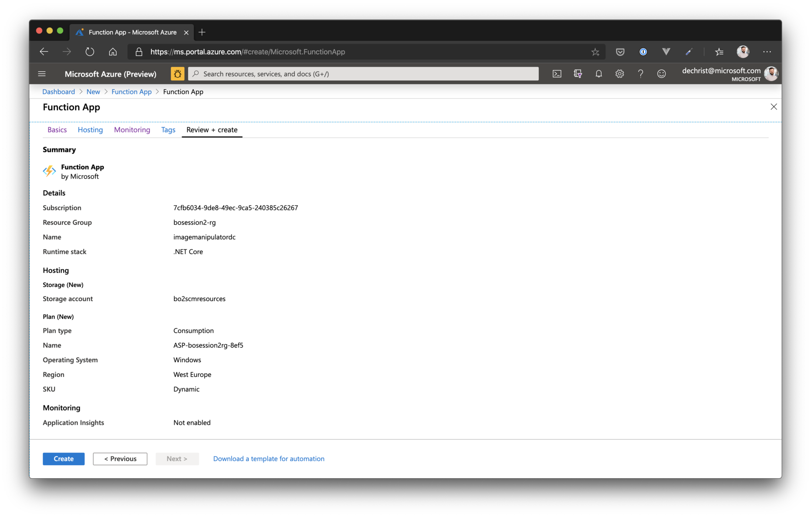
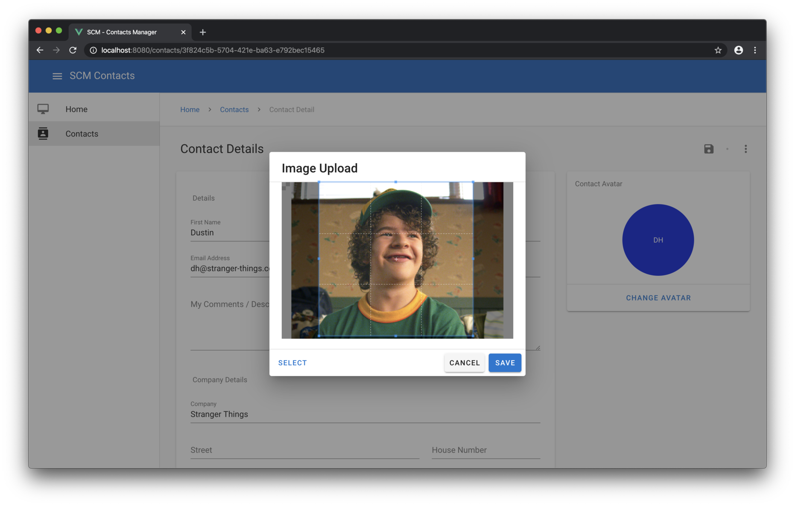
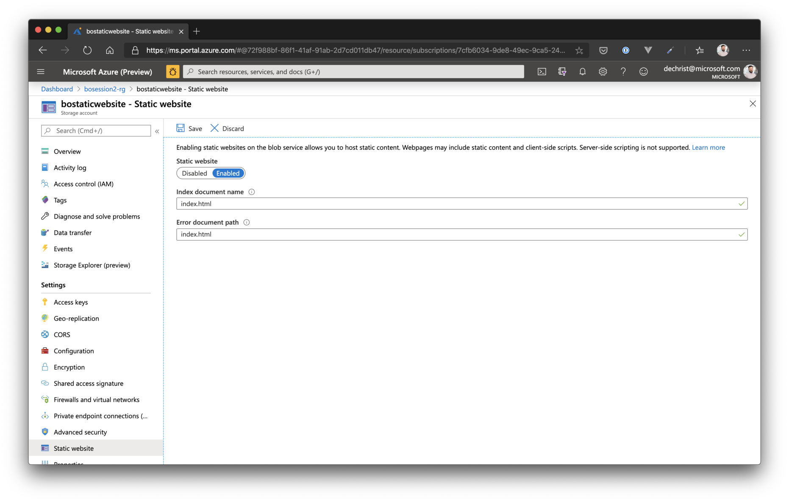
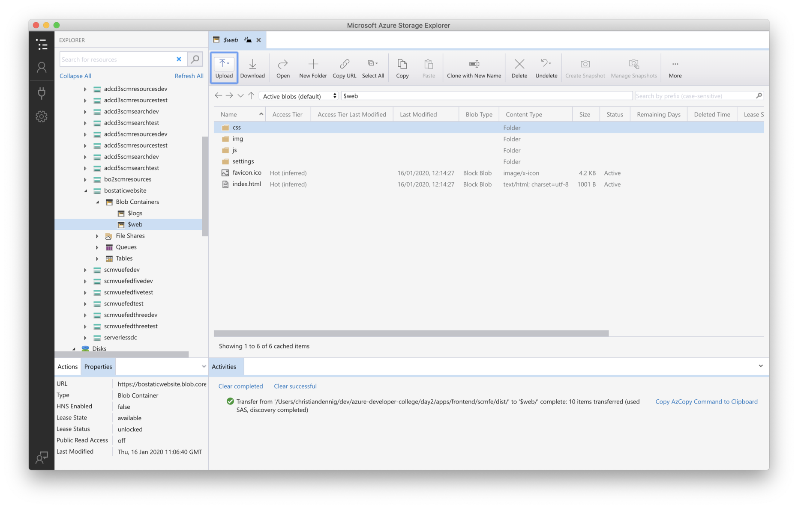
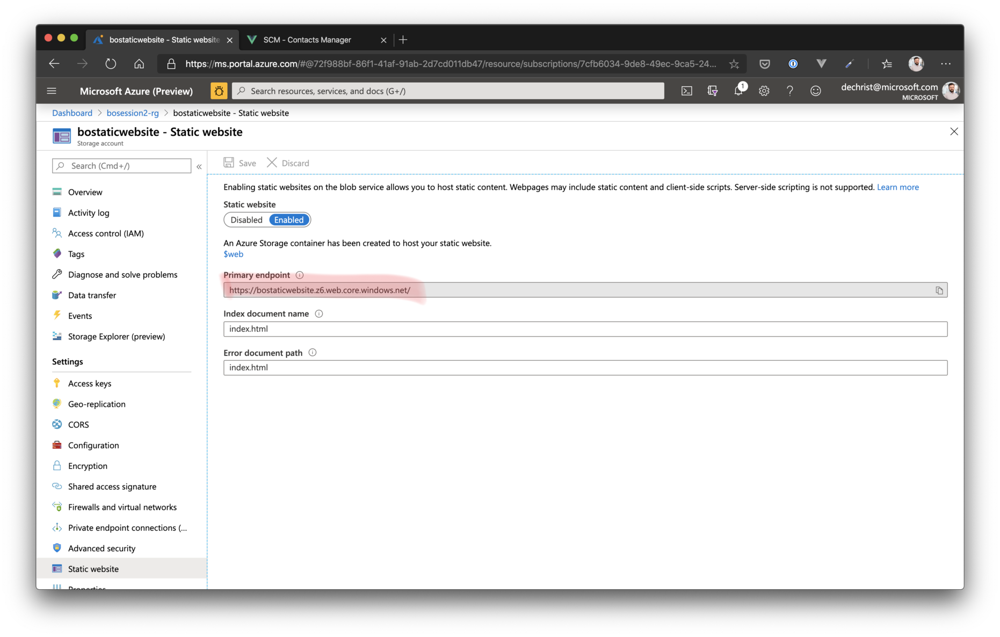

+++
title = "Serverless / Messaging"
chapter = false
pre = "<b>Breakout 2: </b>"
weight = 35
+++

Time for our second "Break-Out" session! 

We now will deploy all required services of our SCM Contacts Management app to Azure, inlcuding the VueJS Single Page Application. To host the SPA (which is basically a static website), we make use of the "Static Website Hosting" option of Azure Storage Accounts - which is the cheapest option to host applications built e.g. with Angular, React or like in our case VueJS. 

We also add a second service, that let's us save images for contacts. That service will be implemented in .NET Core and will use Azure Storage Queues (to make you familiar with another messaging service) to notify an Azure Function that in turn creates thumbnails of the images. The results will then be saved in an Azure Storage Account.

At the end of the day, this will be the architecture of our SCM Contacts Management application:


## Services to handle Contact Images ##

We will start implementing our target architecture by adding a Storage Account to save contact images.

### Storage Account (Container/Queue) ###

Therefore, create a Storage Account in the resource group you took for the first breakout session (should be **scm-breakout-rg**). Create the account having these paramters:

- name the storage account *<YOUR_PREFIX>scmresources*
- Location: *West Europe*
- Performance: *Standard*
- Account Kind: *Storage V2*
- Replication: *LRS*
- Access Tier: *Hot*

When the Storage Account has been created, add two containers where we will be storing the images:

- *rawimages*
  - Public Access Level: *Blob*
- *thumbnails*
  - Public Access Level: *Blob*

Also, add a new ***Queue*** in your Storage Account. Name the queue ```thumbnails```.

The infrastructure for handling images regarding storage and messaging is now set up.

### Azure Function for Image Manipulation ###

In the *Serveless* challenge, we created the Azure Function via the Visual Studio Code wizard. Now, let's see how the the Portal experience is like.

Go to your resource group (**scm-breakout-rg**) and add an Azure Function (in the wizard, search for "Function App").

Follow the wizard and when asked, enter the following information (only important information will be mentioned):

- Basic Tab
  - Function App name: choose a globally unique name
  - Publish: *Code*
  - Runtime Stack: *.NET Core*
  - Region: *West Europe*
- Hosting Tab
  - Storage Account: choose the one you created above
  - Operating System: *Windows*
  - Plan Type: *Consumption*
- Monitoring
  - Enable AppInsights: *No*



When the Function has been created, we need to add a few **Application settings** that our image manipulation function needs to be working correctly.

Please open the Azure Function and switch to the **Configuration** view.

Add the following Application settings:

| Name | Value / Hints |
| --- | --- |
| QueueName | *thumbnails* |
| StorageAccountConnectionString | take the **Connection String** from your Storage Account (under ***Access Keys***) |
| ImageProcessorOptions__StorageAccountConnectionString | take the **Connection String** from your Storage Account (under ***Access Keys***) |
| ImageProcessorOptions__ImageWidth | *100* |
<hr>
<br>
Save your settings. The Functions app will now restart to apply your changes.

It's time to deploy the Image Resizer Function App to Azure. 

<span style="color:red">**Important**</span>: You need to open a new Visual Studio Code window and open folder **day2/apps/dotnetcore/Scm.Resources/Adc.Scm.Resources.ImageResizer**. The deployment steps have to be done in that new window!

To deploy the function follow these steps:

- go to the **Azure Tools** extension
- in the Functions section, choose your Azure Function you created previously
- right-click on it, choose "Deploy to Function App..."

Deployment of you function starts and after a few seconds, it is running in Azure. You can close that window now. 

### Deploy the Azure Web App providing the API to store images ###

We need to add another Azure Web App to host the "Resources API" of our SCM Contacts application.

1. got to your resource group **scm-breakout-rg**
1. create an Azure Web App (you can choose to use the Portal or the Azure CLI: OS - **Windows**, RuntimeStack - **.NET Core 3.0**, Size - **B1**, AppInsights is not needed at the moment). You can choose the same settings as for the Contacts API.

When the deployment has finished, we also need to add a few settings. Open the Web App in the Portal and go to the "Configuration" view (under **Settings**).

Add the following parameters:

| Name | Value / Hints |
| --- | --- |
| ImageStoreOptions__StorageAccountConnectionString | take the **Connection String** from your Storage Account created in this Break Out session (under ***Access Keys***) |
| StorageQueueOptions__StorageAccountConnectionString | take the **Connection String** from your Storage Account created in this Break Out session (under ***Access Keys***) |
| ImageStoreOptions__ImageContainer | *rawimages* |
| StorageQueueOptions__ImageContainer | *rawimages* |
| ImageStoreOptions__ThumbnailContainer | *thumbnails* |
| StorageQueueOptions__Queue | *thumbnails* |
| StorageQueueOptions__ThumbnailContainer | *thumbnails* |
<hr>
<br>

Now, go back to Visual Studio Code and deploy the Resources API from folder *day2/apps/dotnetcore/Scm.Resources/Adc.Scm.Resources.Api* to the Azure Web App. 

You have done this several times now and should be familiar with the process. For your convenience, we added (as in Break Out Session 1) a task that publishes the .NET Core API to a local folder that you can use as deployment source for the Azure Web App:

- press **F1** and choose **"Tasks: Run Task"**
- select **day2publishScmResources**
- outputs of the build will be placed in **day2/apps/dotnetcore/Scm.Resources/Adc.Scm.Resources.Api/publish**
- choose that folder when "right-click-deploying" from the **Azure Tools / AppService** extension (via "Browse...")

Time for testing!

## Test with you local Single Page Application ##

When everything has been deployed to Azure, open the **settings.js** file of your SPA (folder *day2/apps/frontend/scmfe/public/settings*) and adjust the **resourcesEndpoint** property (also make sure, that **endpoint** points to the Contacts API in Azure). Enter the value of your newly deployed Resources API for it, e.g. https://scmimageresource.azurewebsites.net/.

Switch to the "Debug" view and start the Single Page Application (dropdown: **Day2 - Launch Frontend**).

To test everything we just set up, create a new *Contact* and open the details of it afterwards. On the right side box, you should now see a button called "**CHANGE AVATAR**".



Upload a picture and save the Contact afterwards.

## Host the Single Page Application in Azure ##

We still run the Single Page Application on our local machine. Time to switch to hosting in Azure. As mentioned before, we make use of the "Static Website" feature of Azure Storage Accounts.

It's very simple to use. Create a new Azure Storage Account (or you can reuse the Storage Account for the images/queue). When deployment of the Storage Account is finished, go to "Static website" (under **Settings**) and enable it. As *Index document name* and *Error document path*, choose "index.html".



> When you save the settings, Azure will create a new container called **$web** where you can copy static (web) file to. Azure will serve the contents of this containers as "Static Website".

Now open a commandline, go to folder *day2/apps/frontend/scmfe* and execute:

```shell
$ npm run build

> scmfe@0.1.0 build /Users/christiandennig/dev/azure-developer-college/day2/apps/frontend/scmfe
> vue-cli-service build

   Building for production...
   ...
   ...
   ..
   .

 DONE  Build complete. The dist directory is ready to be deployed.
```

This starts a local build of the VueJS application, which puts all results/artifacts (the static website itself) into the **dist** folder. When the build has finished, copy the content of that *dist* folder via the Storage Explorer to your Storage Account in the ***$web*** container.



Now open the URL for the frontend (you can find it after saving the settings of the Static website under **Primary Endpoint**) and check that the application is up and running.



# Wrap-Up #

***Congratulations***! You have just created your first modern, multi-service Azure-backed application. You made use of Azure AppServices, Storage Accounts, Messaging (Azure Storage Queues), serverless Azure Function Apps and static website hosting. All in combination with a modern VueJS frontend that is also working on mobile devices!
