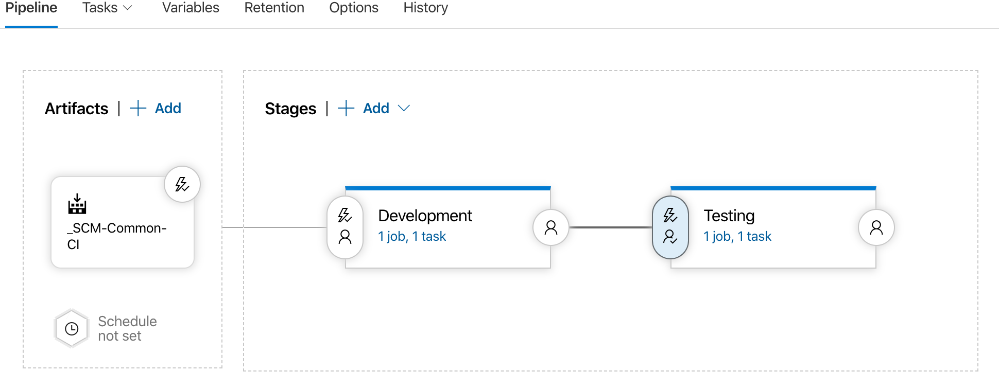
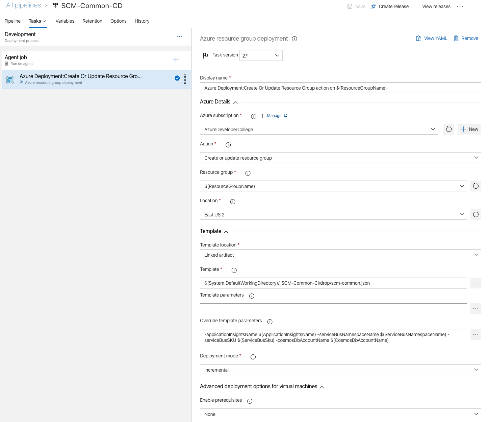
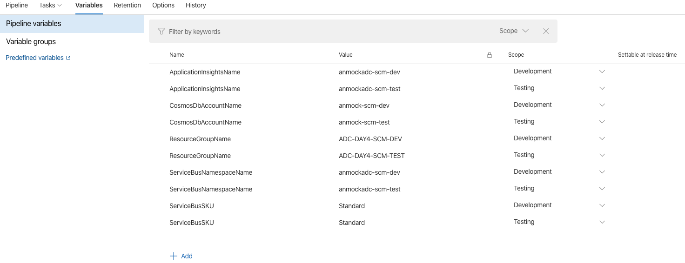
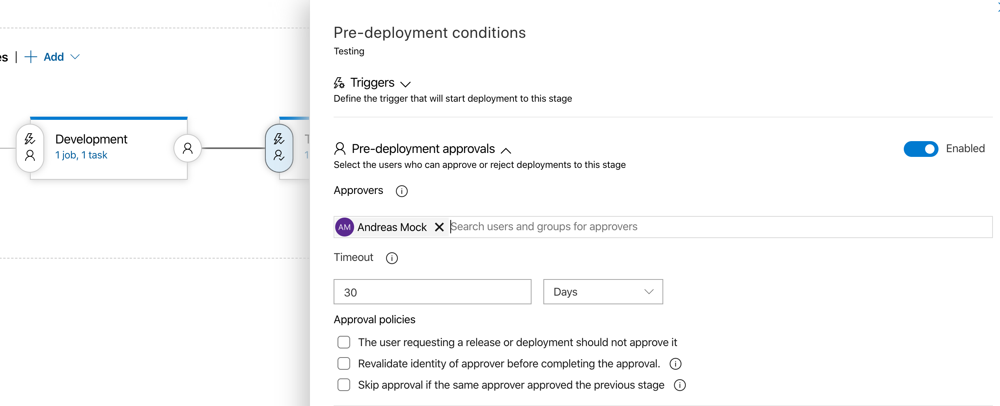
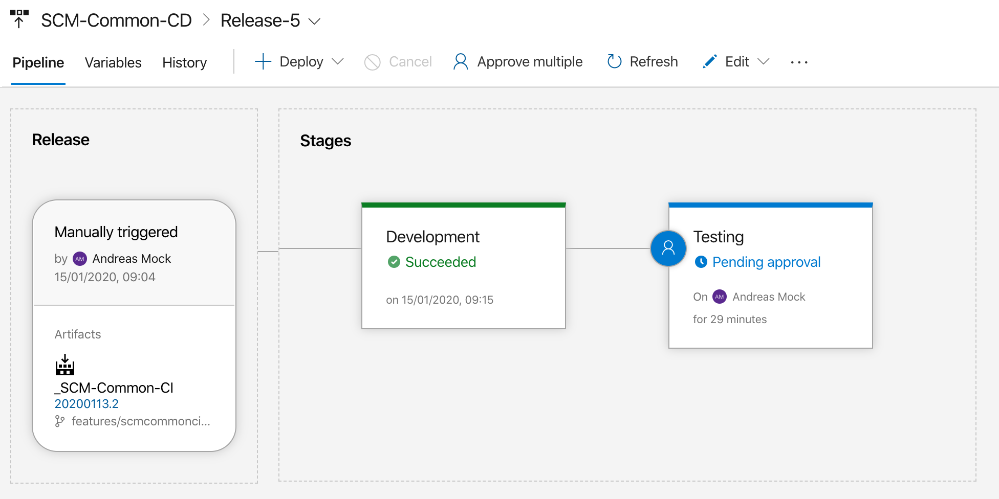
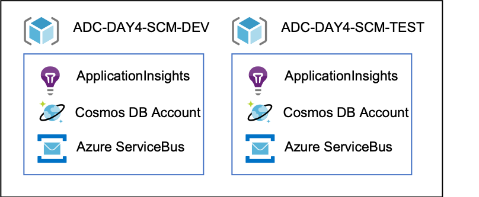

+++
title = "Work with Azure Pipelines"
chapter = false
weight = 30
+++


## Here is what you will learn
- Create a Service Connection to deploy Azure resources
- Create a CI build to create and version your deployment artifacts
- Create a CD build to deploy your artifacts to Azure

In this challenge we start to deploy the sample application's common used components to Azure. We create an instance of Azure ServiceBus and an Azure Comsos DB account using an ARM Template. You do not need to create the ARM Template by yourself, it is already available in the repository.

If you have never used Azure Pipelines have a look at the [documentation](https://docs.microsoft.com/azure/devops/pipelines/get-started/what-is-azure-pipelines?view=azure-devops).

Azure Pipelines is a cloud service that you can use to automatically build and test your code project and make it available to other users. It works with just about any language or project type.

Azure Pipelines combines continuous integration (CI) and continuous delivery (CD) to constantly and consistently test and build your code and ship it to any target.

Here is an overview of what we want to achieve in this challenge:


## Create an Azure Service Connection

Before we can start to deploy Azure resources we need to create a Service Connection to Azure's Resource Manager that allows us to access your Azure subscription. When the Azure Pipeline's build agent executes deployment steps the build agent must use a ServicePrincipal that was granted to access your Azure subscription as an *Owner*. You can define service connections in Azure Pipelines that are available for use in all your tasks.  

1. In your Azure DevOps project, open the Service connections page from the project settings page
2. Choose *New Service connection* and select *Azure Resource Manager*
3. Give your connection a name
4. Select *Subscription* under Scope level
5. Select your subscription and click *OK*

**Hint:** After you have clicked *OK* Azure DevOps tries to access Azure AD on behalf of the signed-in user (that's you, of course) to create a Service Principal and assigns it the *Owner* role of your selected subscription. If you get an error you can use the *use the full version of the service connection dialog* link to use a predefined Service Principal that was created by your Azure AD administrator.

## Create your first CI Build

Go to Azure Boards and set the UserStory S3 to active. We create a new build definition that copies the needed ARM Template to an artifact location that is managed by Azure DevOps. An artifact location is a storage location where Azure Pipelines copies all files that are needed for a successfull deployment of an application. The artifact location is linked to your build. Every build gets its own unique build number and therefore your artifact is versioned, too.

1. Create a feature branch *"features/scmcommcicd"* and check it out
2. Create a folder named "pipelines" under day4/apps
3. Add a file named scm-common-ci.yaml
4. Add the following yaml snippet that defines the build Trigger:
   ```yaml
   pr: none
   trigger:
     branches:
       include:
         - master
     paths:
       include:
         - day4/apps/infrastructure/templates/scm-common.json

   ```
   Here we specified when the build must be triggered. The build is triggered only if changes were made to the master branch and when the changes were made to either *day4/apps/infrastructure/templates/scm-common.json* or *day4/apps/pipelines/cd-scm-common.yaml*
5. Add the following yaml snippet that defines the build steps:
   ```yaml
   jobs:
     - job: Build
       displayName: Build Scm Common
       pool:
         vmImage: ubuntu-latest
       steps:
         - task: UseDotNet@2
           displayName: 'Acquire .NET Core Sdk 3.1.x'
           inputs:
             packageType: Sdk
             version: 3.1.x
         - task: CopyFiles@2
           inputs:
             sourceFolder: day4/apps/infrastructure/templates
             contents: |
              scm-common.json
             targetFolder: $(Build.ArtifactStagingDirectory)
         - task: PublishPipelineArtifact@1
           inputs:
             targetPath: $(Build.ArtifactStagingDirectory)
             artifactName: drop
   ```
   Here we specified to copy the needed ARM Template to our artifact's drop location named *"drop"*.
   First we use a copy task to copy the ARM Template to the build agent's *"ArtifactStagingDirectory"*. This directory is a temp directory on the build agent. After that we can publish the build agent's artifact directory to link the created artifacts to the build. In addition we specified to use a build agent that uses the latest Ubuntu version. [Here](https://docs.microsoft.com/en-us/azure/devops/pipelines/agents/hosted?view=azure-devops#use-a-microsoft-hosted-agent) you can find a list of supported build agent images.

6. Commit your changes and push the branch to your remote repository.
7. Navigate to your Azure DevOps project
8. In your project navigate to the Pipelines page. Then choose the action to create a new Pipeline
9. Walk through the steps of the wizard by first selecting Azure Repos Git as the location of your source code
10. Select your college repository
11. Select *"Existing Azure Pipelines YAML file"*
12. Select your feature branch and specify the path: *"/day4/apps/pipelines/scm-common-ci.yaml"*
13. Run your CI Build by clicking the action *"Run"*
14. Rename your CI Build to *"SCM-Common-CI"*
15. Navigate to the Pipelines page and open the last run of the build *"SCM-Common-CI"*. You see that the artifact is linked to your build.
    

## Create your first CD Build

Now that we have created the build artifact, we can create a Release build to deploy the common component's Azure infrastructure for the sample application to a Development and Testing stage.
[Here](https://docs.microsoft.com/en-us/azure/devops/pipelines/release/?view=azure-devops) you find a detailed documentation about Release pipelines.



1. Navigate to your Azure DevOps project and open the Releases page under Pipelines.
2. Choose the action item to create a new Pipeline and start with an *"Empty Job"*.
3. Rename *"Stage1"* to *"Development"*
4. Rename the Release pipeline to *"SCM-Common-CD"*
5. Click *"Add an artifact"* and select your *"SCM-Common-CI"* and always use the latest build.
6. Click the *"Flash"* icon under artifacts and set the trigger to *"Continuous deployment trigger"*. This will trigger the Release pipeline whenever a new deployment artrifact of the build *"SCM-Common-CI"* is created.
7. Go to the variable section and add the following variables:
   - ResourceGroup - ADC-DAY4-SCM-DEV
   - ApplicationInsightsName - appinsights-scm-dev
   - ServiceBusnamespaceName - |your prefix|-scm-dev (the namespace name must be globally unique)
   - ServiceBusSKU - Standard
   - CosmosDbAccountName - |your prefix|-scm-dev (the account name must be globally unique)
8. Go to the Tasks section of the *"Development"* stage and add the task *"Azure resource group deployment"*
   - Select the Azure subscription
   - Use the variable for the ResourceGroup: $(ResourceGroup)
   - Select a location where you want to deploy the Azure resources
   - Under *Template* select the *"scm-common.json"* ARM template by clicking *"..."*
   - Override parameters: Copy the following line, make sure that you copy the whole line:
      ```
      -applicationInsightsName $(ApplicationInsightsName) -serviceBusNamespaceName $(ServiceBusNamespaceName) -serviceBusSKU $(ServiceBusSku) -cosmosDbAccountName $(CosmosDbAccountName)
      ```
    
9. Under Agent job set the Agent specification to the latest Ubuntu version
    

10. Save the definition and run the pipeline by clicking *"Create release"*.

### Add a Testing stage to your CD Build

Now we have successfully deployed the common components to the Development environment. Next we create another stage that is deployed when the deployment to the Development stage was successful.
In addition we add a *"Pre-deployment conditions"* step to control the deployment to the Testing stage manually. 

1. Start editing the CD Build *SCM-Common-CD* and go to the Pipeline view
2. Clone the *Development* stage and rename the cloned stage to *"Testing"*
3. Open the *Variables* view
4. When you open the scope dropdown of a variable you notice that there are three scopes available:
   - Release: The variable is used for all stages of the pipeline
   - Development: The variable is only applied to the stage *Development*
   - Testing: The variable is only applied to the stage *Testing*
   -  

5. Move all existing variables to the scope of the *Development* stage
6. Add all variables again with the same name but change all values to contain the word *test* as suffix or prefix and apply them to the scope *Testing*
   
7. Switch back to the pipeline view of your release definition and set the *Pre-deployment conditions* as follows
   

8. Save your release definition

### Approve the deployment to the Testing environment

Now create a new realease and wait until the *Development* stage is deployed. 
You will see that the pipeline is stopped and that the deployment to the *Testing* stage must first be approved by a predefined approver.



Approve the the deployment to the *Testing* environment.


## Merge your changes to the master branch

Now you can create a *PullRequest* and merge your changes to the master branch.

## Wrap up

__Congratulations__ you have completed the UseStory S3!
We have created a CI/CD Pipeline that is triggered whenever changes are made to the sample application's common infrastructure.  
Take a look at the Azure portal and see which Azure resources were created. And don't forget to go to the Azure Boards and complete the UserStory S3. 

